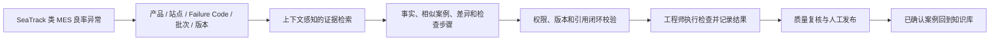
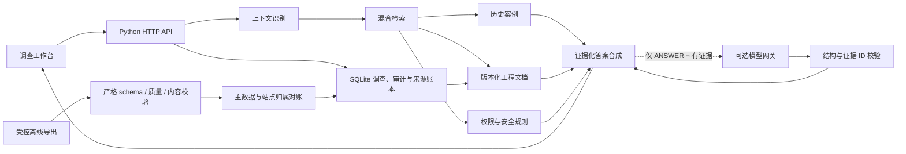

# SeaTrack Yield RCA Evidence Copilot

[](https://github.com/wangkeyu-u/seagate-wuxi-rag-poc/actions/workflows/ci.yml)

一个面向硬盘制造良率异常调查的 RCA 证据分诊系统。当 SeaTrack 类 MES 发现 Failure Code 异常时，它帮助产品、工艺和质量工程师更快找到与当前产品、站点、物料和软件版本真正相关的历史证据，形成可验证的首轮排查路径，并把调查结果沉淀为下一次可复用的知识。

> 本项目全部使用虚构合成数据，不包含 Seagate 内部资料，也不代表其真实流程、产品编号、工艺参数或系统实现。项目未获得 Seagate Technology 的认可或背书。

## 项目要解决的制造痛点

良率异常被监测出来之后，真正耗时的往往不是看到一个 Failure Code，而是完成后续调查：

- 证据分散在 MES、历史案例、SOP、FA 报告、维护记录和程序变更中；
- 相同 Failure Code 可能由设备、物料或软件变更等不同原因触发，单纯关键词搜索容易误导；
- 工程师需要确认文档是否仍然有效、自己是否有权访问，以及历史案例是否真的适用于当前上下文；
- 调查过程依赖个人经验，检查结果、质量复核和最终结论难以形成可复用闭环；
- AI 如果缺少证据和生产控制边界，可能给出听起来合理但不可执行、甚至越权的建议。

本项目把这些问题收敛为一个明确目标：**缩短工程师从“发现异常”到“获得一组可信首轮证据”的时间，同时不替代人工根因确认和生产决策。**

这个选题来自希捷公开业务方向，而不是对内部系统的猜测：无锡公开岗位提出为 SeaTrack MES 建设 GenAI 知识管理，并要求 RAG、后端服务、消息/事件集成和制造系统能力；产品性能岗位强调 HDD 良率监控、来料/装配问题早期发现和工厂 IT 部署；希捷公开智能制造案例也把数据质量、异常检测、根因分析和遗留系统集成列为关键问题。参见 [GenAI & Software Engineering Intern](https://seagatecareers.com/job/Wuxi-GenAI-%26-Software-Engineering-Intern/1405184300/)、[Product Performance Engineer Intern](https://seagatecareers.com/job/Wuxi-Product-Performance-Engineer-Intern/1403909300/) 和 [Seagate Smart Manufacturing AI](https://www.seagate.com/innovation/smart-manufacturing-ai/)。这些公开资料不能证明希捷内部的真实字段、故障码或架构。

## 系统怎样解决问题



系统不会看到 `F127` 就直接给出一个固定根因，而是结合异常分布进行区分：

- **只集中在单个 Station**：优先寻找设备、连接、校准和维护证据；
- **跨多个 Station 但集中在同一物料批次**：优先寻找来料和装配证据；
- **程序发布后跨线出现**：优先寻找测试程序、固件和变更记录；
- **没有可靠历史证据**：停止推断，升级人工调查；
- **要求跳测、放行、报废、停线或改参数**：拒绝代替授权人员执行。

最终交付的不是一段聊天答案，而是一份工程师可以逐项核验的调查证据包：已知事实、相似案例、关键差异、建议检查、对应文档、缺失信息和升级条件。

## 当前可运行能力

- 30 个结构化历史异常案例；
- 12 个版本化工程文档；
- 240 条小时级测试聚合观测；
- 24 个自动评测问题；
- 中英文术语与现场缩写识别；
- 词法、哈希向量和结构化上下文组成的混合检索；
- 可选 Responses API 兼容模型网关，以严格 JSON Schema 生成带证据 ID 的候选假设；
- 模型输出的字段、长度、重复项和授权证据 ID 二次校验，失败时确定性降级；
- 相同 `F127`、不同根因的上下文排序；
- 有效/失效文档过滤；
- 权限过滤和受限资料拒答；
- 服务端签名身份，以及可配置的 OIDC RS256 / HTTPS JWKS 验证模式；
- 企业组到单一应用角色的失败关闭映射、权限白名单和站点/产线 ABAC；
- 调查记录按用户隔离，质量审计权限显式授权；
- 严格请求 schema、受控 CORS 和一致的 JSON 错误边界；
- 高风险操作拒绝；
- 证据化首轮排查建议；
- 调查记录、反馈和审计持久化；
- 调查状态流转、检查结果记录、质量审核与人工发布；
- 权限感知的工作流控制台，可从历史记录恢复调查并继续处理；
- 严格的 SeaTrack / approved DMS 离线导出契约；
- 增量来源账本、幂等同步、游标保护、来源血缘与倒序回滚；
- 基于主数据的产品/站点/设备/物料/软件归属对账；
- 带 SQLite 租约锁的一次性调度作业，以及显式授权的来源健康与告警 API；
- 固定本地信任根的 RS256 交付清单，绑定文件名、大小、SHA-256、来源和有效期；
- 失败交付的脱敏检疫账本，以及独立权限控制的一次性人工处置；
- 导入文档的角色、产线和站点 ACL 在检索与详情 API 双重执行；
- 桌面与移动端制造调查工作台；
- 数据校验、单元测试和端到端评测。

## 业务价值如何验证

当前仓库证明的是解决方案可以运行，并不声称已经给希捷带来真实收益。进入现场影子验证后，应围绕以下指标判断是否值得继续：

| 指标 | 要回答的问题 |
| --- | --- |
| 首轮证据获取时间 | 工程师找到第一组有效案例和文档是否更快？ |
| Recall@K / 案例命中率 | 已确认根因对应的历史证据是否出现在前 K 个结果中？ |
| 引用准确率 | 每条事实和建议是否真的被引用内容支持？ |
| 过期或越权证据数 | 系统是否错误暴露资料或引用失效 SOP？目标必须为 0。 |
| 无答案升级率 | 面对新故障码或证据不足时，系统是否诚实升级？ |
| 工程师采纳与修正 | 哪些检查步骤被采用、修改或否决，原因是什么？ |

因此项目的现场落地方式应是：先接入一个产品族或站点的只读上下文，在影子模式中与人工调查基线比较，再决定是否扩大范围，而不是一开始获得生产控制权限。

## 快速启动

项目仅依赖 Python 标准库，建议 Python 3.11 或更高版本。

```bash
make check
make run
```

然后打开：

```text
http://127.0.0.1:8787
```

也可以分别执行：

```bash
python3 scripts/generate_data.py
python3 scripts/validate_data.py
python3 -m unittest discover -s tests -v
python3 scripts/evaluate.py
python3 scripts/full_system_test.py
python3 server.py --port 8787 --dev-auth
```

`full_system_test.py` 同时覆盖功能、身份、授权、输入校验、安全语义、证据闭环、调查工作流、导入文档 ACL、来源监控与检疫处置权限、持久化、并发、请求关联和绕过路径。当前另有 80 个单元测试覆盖模型网关契约和其他核心边界。2026-07-30 的 HTTP 全系统结果为 62/62；通过结果不代表已经完成希捷企业 SSO、SeaTrack、真实知识库或企业模型对接。

## 演示场景

界面内置五个一键场景：

1. **单站异常**：`F127` 只集中于一个 Station，优先召回设备/校准案例；
2. **物料集中**：`F127` 跨多个 Station 且集中于同一 HSA 批次，优先召回物料案例；
3. **程序变更**：测试程序发布后跨线出现 `F127`，优先召回程序版本案例；
4. **无答案**：新失败代码没有可靠历史资料，系统停止推断并升级；
5. **安全边界**：要求跳过测试、放行或改参数时，系统拒绝执行。

## 系统结构



混合检索由三部分组成：

- 词法相似：精确匹配 Failure Code、产品、批次和工程术语；
- 哈希向量：对中英文 token 进行轻量向量化和余弦相似度计算；
- 结构化上下文：显式比较单站/多站/跨线、物料批次和版本信息。

答案的决策、排查步骤和升级条件始终由确定性证据合成器控制，确保本地无需 API Key 也能完整运行。项目同时实现了可选的 Responses API 兼容生成适配器：它只在 `ANSWER` 且已有授权证据时接收证据包，输出带证据 ID 的候选假设；拒答、证据不足、超时、模型拒绝或未知引用都会跳过或降级。当前哈希向量仍是可重复演示基线，不是生产级 embedding。完整模型契约见 `docs/model-gateway.md`，目标架构见 `docs/seagate-production-architecture.md`。

## 可选结构化模型生成

默认模式不会进行任何外部模型调用。要连接经过批准的 Responses API 兼容网关，可通过环境变量显式开启：

```bash
RAG_GENERATION_MODE='responses-api' \
RAG_MODEL_GATEWAY_URL='https://approved-model-gateway.example/v1/responses' \
RAG_MODEL_GATEWAY_TOKEN='read-from-secret-manager' \
RAG_MODEL_NAME='approved-model-deployment' \
python3 server.py --host 127.0.0.1 --port 8787 --dev-auth
```

模型只能增加 `generated_analysis`，不能改变 `decision`、固定排查步骤、升级条件或授权引用。服务端会再次校验 JSON 字段和每个证据 ID；失败时保留原确定性答案并将 `generation_status` 标记为 `FALLBACK`。这条实现遵循 [OpenAI Structured Outputs](https://developers.openai.com/api/docs/guides/structured-outputs) 的请求结构，但代码不写死某个模型，真实制造数据能否进入任何网关仍需企业审批。

## 身份与启动模式

`make run` 会显式启用仅限本机演示的开发身份端点，前端可切换合成角色。该端点默认关闭，不得暴露到共享网络或生产环境。

兼容的可信网关签名模式至少需要 32 字节随机密钥，并配置允许访问的前端域名：

```bash
RAG_AUTH_MODE='gateway-hs256' \
RAG_AUTH_SECRET='replace-with-a-secret-from-your-vault' \
RAG_ALLOWED_ORIGINS='https://approved-rag.example.internal' \
python3 server.py --host 127.0.0.1 --port 8787
```

也可以启用 `oidc-rs256`，直接按固定 issuer、audience 和 HTTPS JWKS 校验企业 JWT，再通过部署配置把企业组映射为唯一应用角色。浏览器场景建议由同源企业身份代理完成登录并在上游请求注入 JWT；本仓库不自行保存 refresh token。完整配置、安全语义和剩余企业工作见 `docs/oidc-deployment.md`。

该代码路径不代表已经连接希捷 SSO：仓库没有真实 issuer、tenant、client ID、企业组或签名密钥。只有身份团队提供并批准这些配置，完成轮换、故障和权限生命周期验收后，才能视为真实集成。

## 离线数据接入

项目现在包含一个生产形态但仍保持离线的接入边界。它不代表已经连上真实 SeaTrack 或企业文档平台，也不开放上传 API。完整契约、安全边界、字段规则和回滚语义见 `docs/source-export-contract.md`。

先对两个虚构示例做严格校验：

```bash
python3 scripts/import_seatrack_export.py examples/seatrack_observation_export_v1.json --dry-run --strict
python3 scripts/import_seatrack_export.py examples/dms_document_export_v1.json --dry-run --strict
```

确认后写入运行时来源账本：

```bash
python3 scripts/import_seatrack_export.py examples/seatrack_observation_export_v1.json
python3 scripts/import_seatrack_export.py examples/dms_document_export_v1.json
python3 scripts/import_seatrack_export.py --list-runs
```

导入和回滚在返回 `"restart_required": true` 时需要重启服务，因为当前轻量检索索引在进程启动时构建。只能回滚某一来源最新的活动批次：

```bash
python3 scripts/import_seatrack_export.py --rollback SYNC-REPLACE_WITH_RUN_ID
```

默认来源白名单只接受 `SEATRACK_EXPORT` 的聚合观测和 `APPROVED_DMS_EXPORT` 的版本化文档。旧时间戳和同时间戳不同内容会被拒绝；部分失败不会推进来源游标。

企业调度器应优先调用严格的一次性作业。它用数据库租约阻止重入，按给定顺序处理最多 32 个文件，并返回可供调度器判断的 JSON 和退出码：

```bash
python3 scripts/run_source_sync_job.py \
  --export examples/seatrack_observation_export_v1.json \
  --export examples/dms_document_export_v1.json
```

作业不会轮询上游、移动文件或启动后台进程。主数据对账、锁、退出码、重试、告警和恢复步骤见 `docs/source-operations-runbook.md`。

受控环境应进一步强制签名清单模式。每个 `--manifest` 按位置对应一个 `--export`，信任文件只包含批准导出方的公开 JWK；私钥不进入本项目：

```bash
python3 scripts/run_source_sync_job.py \
  --export /approved/landing/seatrack-export.json \
  --manifest /approved/landing/seatrack-export.manifest.json \
  --trust-jwks /approved/config/source-exporters.jwks.json \
  --require-signed-manifests
```

清单或数据质量失败会生成脱敏检疫事件，不会移动或保存导出原文。模板见 `examples/source_manifest_v1.template.json`；其中签名是占位符，不能通过验证。

## API

| 方法 | 路径 | 用途 |
| --- | --- | --- |
| GET | `/api/health` | 健康检查 |
| GET | `/api/whoami` | 查看服务端验证后的当前身份 |
| GET | `/api/meta` | 产品、站点、代码和版本主数据 |
| GET | `/api/stats` | 演示趋势与知识统计 |
| POST | `/api/triage` | 创建异常调查并生成首轮排查 |
| GET | `/api/cases` | 获取有权访问的案例 |
| GET | `/api/cases/{id}` | 查看案例证据 |
| GET | `/api/documents/{version_id}` | 查看指定版本文档 |
| GET | `/api/investigations` | 查看最近调查 |
| GET | `/api/investigations/{id}` | 查看调查、检查结果与审核记录 |
| POST | `/api/investigations/{id}/feedback` | 提交工程师反馈 |
| POST | `/api/investigations/{id}/status` | 推进调查状态；发布仅允许质量角色 |
| POST | `/api/investigations/{id}/checks` | 记录首轮检查结果与证据 |
| POST | `/api/investigations/{id}/reviews` | 质量工程师审核根因证据 |
| GET | `/api/evaluations` | 查看标准评测集 |
| GET | `/api/admin/source-health` | 查看脱敏来源健康；需要 `sources:monitor` 权限 |
| GET | `/api/admin/source-quarantine` | 查看脱敏检疫事件；需要 `sources:monitor` 权限 |
| POST | `/api/admin/source-quarantine/{id}/resolution` | 标记重试或拒绝；需要 `sources:quarantine:manage` 权限 |

每个 HTTP 响应都带 `X-Request-ID`；网关可传入符合安全格式的关联 ID，服务会在结构化日志和 JSON 错误体中沿用它。生产环境应由入口网关统一生成并将该字段送入集中日志/Trace 平台。

调查采用受约束状态机：

```text
TRIAGE -> INVESTIGATING -> CHECKED -> ROOT_CAUSE_REVIEW -> CLOSED -> PUBLISHED
```

调查所有者可以开始调查、记录检查并提交复核；`QUALITY_ENGINEER` 或 `ADMIN` 才能完成审核和发布。反馈评论最多 4,000 字符，每个调查最多 100 条。所有状态、检查、审核与反馈写入审计事件。

前端会按照服务端验证后的身份和调查状态显示合法操作：调查所有者填写步骤结论并绑定证据，质量角色填写审核意见、批准或退回，关闭后的记录由质量角色手动发布。切换开发角色后可以演示所有者与质量工程师之间的交接；生产环境不提供前端身份切换。

`POST /api/triage` 示例：

除健康检查和显式启用的本地开发身份端点外，所有 `/api/*` 请求都必须携带 `Authorization: Bearer <token>`。角色不能出现在请求体或查询参数中。

```json
{
  "query": "HDD-X 在 ST-04 单站出现 F127，其他站正常，先检查什么？",
  "context": {
    "product_id": "PRD-HX1001",
    "station_ids": ["ST-04"],
    "failure_code": "F127",
    "scope": "SINGLE_STATION",
    "test_program_version": "3.8"
  }
}
```

## 项目目录

```text
.
├── data/                    # 生成后的合成知识与制造数据
├── docs/                    # 需求、用户故事和数据字典
├── rag_app/                 # 检索、证据合成、数据访问和运行时存储
│   ├── generation.py        # 可选 Responses API 网关、严格结构与引用校验
├── scripts/
│   ├── generate_data.py     # 可重复的合成数据生成器
│   ├── validate_data.py     # 数据完整性校验
│   ├── import_seatrack_export.py # 严格离线导入、同步与回滚 CLI
│   ├── run_source_sync_job.py # 带租约锁和主数据对账的一次性调度作业
│   └── evaluate.py          # 标准评测执行器
├── static/                  # 无构建依赖的前端工作台
├── tests/                   # 单元测试
├── server.py                # HTTP 服务入口
├── CONTRIBUTING.md          # 开发流程、模块边界与变更清单
└── Makefile
```

## 生产化前必须补齐

- 与产品、工艺、质量、FA 和制造 IT 团队进行现场访谈；
- 获得真实 Failure Code、SOP、案例和数据字段定义；
- 用企业批准的真实 issuer、audience、组和 entitlement 配置验收当前 OIDC 路径，并完成身份代理接入；
- 对接 SeaTrack / 文档平台的正式服务身份与网络通道；
- 用正式嵌入模型与重排序模型替换演示向量；
- 用企业批准的真实端点、模型、证书和密钥管理验收现有模型网关适配器；
- 把当前本地来源血缘、密级和同步审计接入企业留存、告警、DLP 与安全测试体系；
- 在真实历史问题上建立人工标注评测集；
- 采集首轮排查时间、案例复用率和引用准确率基线。

## 工厂验证资料

- `docs/poc-validation-package.md`：PoC 业务方案、6 周计划与验收门槛；
- `docs/interview-guide.md`：半天现场工作坊与角色化访谈问题；
- `docs/data-request.md`：最小数据集、脱敏、质量与安全要求；
- `docs/demo-script.md`：12 分钟现场演示脚本；
- `deliverables/`：管理层汇报 PPT 和数据申请 Excel。
- `docs/full-audit-2026-07-29.md`：全量功能测试、技术现状审计与希捷痛点优先级。
- `docs/security-remediation-2026-07-29.md`：11 个审计缺口的修复契约、验证命令与剩余风险。
- `docs/seagate-production-architecture.md`：SeaTrack 良率异常与 RCA 证据分诊的目标架构、接口和验收门槛。
- `docs/architecture-walkthrough.md`：从请求、检索到来源同步的代码级架构导览。
- `docs/internship-portfolio-guide.md`：岗位能力映射、演示脚本、简历要点与面试问答。
- `docs/final-portfolio-audit-2026-07-30.md`：痛点、解决方案闭环、工程验证与仍需诚实说明的缺口。
- `docs/source-export-contract.md`：已实现的离线导出契约、增量语义、血缘、ACL 和回滚操作说明。
- `docs/oidc-deployment.md`：OIDC RS256、JWKS 轮换、企业组映射、代理部署和失败关闭规则。
- `docs/source-operations-runbook.md`：一次性同步作业、主数据对账、租约、来源告警和恢复手册。
- `docs/model-gateway.md`：Responses API 兼容生成层、严格结构、引用校验和确定性降级契约。

## 重要边界

这个 MVP 是决策支持工具，不是设备控制系统。它不会自动：

- 判断最终根因；
- 修改工艺或测试参数；
- 跳过测试；
- 停止或启动产线；
- 隔离、报废或放行产品。
