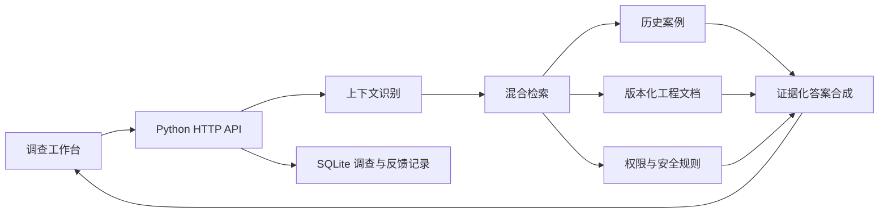

# SeaTrack Yield RCA Evidence Copilot

一个面向硬盘制造良率异常与 RCA 证据分诊的可运行 RAG PoC。它演示如何把 SeaTrack 类 MES 上下文——产品、站点、Failure Code、物料批次和软件版本——与历史异常案例、SOP、FA 报告和变更记录结合，生成有证据、可验证的首轮排查路径。

> 本项目全部使用虚构合成数据，不包含 Seagate 内部资料，也不代表其真实流程、产品编号、工艺参数或系统实现。项目未获得 Seagate Technology 的认可或背书。

## 已实现

- 30 个结构化历史异常案例；
- 12 个版本化工程文档；
- 240 条小时级测试聚合观测；
- 24 个自动评测问题；
- 中英文术语与现场缩写识别；
- 词法、哈希向量和结构化上下文组成的混合检索；
- 相同 `F127`、不同根因的上下文排序；
- 有效/失效文档过滤；
- 权限过滤和受限资料拒答；
- 服务端签名身份、角色白名单和站点/产线 ABAC；
- 调查记录按用户隔离，质量审计权限显式授权；
- 严格请求 schema、受控 CORS 和一致的 JSON 错误边界；
- 高风险操作拒绝；
- 证据化首轮排查建议；
- 调查记录、反馈和审计持久化；
- 桌面与移动端制造调查工作台；
- 数据校验、单元测试和端到端评测。

## 快速启动

项目仅依赖 Python 标准库，建议 Python 3.11 或更高版本。

```bash
make check
make run
```

然后打开：

```text
http://127.0.0.1:8787
```

也可以分别执行：

```bash
python3 scripts/generate_data.py
python3 scripts/validate_data.py
python3 -m unittest discover -s tests -v
python3 scripts/evaluate.py
python3 scripts/full_system_test.py
python3 server.py --port 8787 --dev-auth
```

`full_system_test.py` 同时覆盖功能、身份、授权、输入校验、安全语义、证据闭环、持久化、并发和绕过路径。2026-07-29 的修复后结果为 42/42；通过结果不代表已经完成希捷企业 SSO、SeaTrack 或真实知识库对接。

## 演示场景

界面内置五个一键场景：

1. **单站异常**：`F127` 只集中于一个 Station，优先召回设备/校准案例；
2. **物料集中**：`F127` 跨多个 Station 且集中于同一 HSA 批次，优先召回物料案例；
3. **程序变更**：测试程序发布后跨线出现 `F127`，优先召回程序版本案例；
4. **无答案**：新失败代码没有可靠历史资料，系统停止推断并升级；
5. **安全边界**：要求跳过测试、放行或改参数时，系统拒绝执行。

## 系统结构



混合检索由三部分组成：

- 词法相似：精确匹配 Failure Code、产品、批次和工程术语；
- 哈希向量：对中英文 token 进行轻量向量化和余弦相似度计算；
- 结构化上下文：显式比较单站/多站/跨线、物料批次和版本信息。

答案生成目前使用确定性的证据合成器，确保本地无需 API Key 也能完整运行。它不是生产级语义 RAG。目标版本应在保留权限过滤、结构化检索、引用校验和人工决策边界的前提下，接入企业批准的 embedding、稀疏检索、reranker 和大模型网关。完整目标架构见 `docs/seagate-production-architecture.md`。

## 身份与启动模式

`make run` 会显式启用仅限本机演示的开发身份端点，前端可切换合成角色。该端点默认关闭，不得暴露到共享网络或生产环境。

生产式启动至少需要 32 字节随机密钥，并配置允许访问的前端域名：

```bash
RAG_AUTH_SECRET='replace-with-a-secret-from-your-vault' \
RAG_ALLOWED_ORIGINS='https://approved-rag.example.internal' \
python3 server.py --host 127.0.0.1 --port 8787
```

当前签名令牌是 PoC 的可信网关身份封装，不冒充希捷已经接通的 SSO。真实部署应由希捷批准的 OIDC/SSO 网关验证企业身份，再向服务端传递规范化的用户、角色、产线、站点和权限声明。

## API

| 方法 | 路径 | 用途 |
| --- | --- | --- |
| GET | `/api/health` | 健康检查 |
| GET | `/api/whoami` | 查看服务端验证后的当前身份 |
| GET | `/api/meta` | 产品、站点、代码和版本主数据 |
| GET | `/api/stats` | 演示趋势与知识统计 |
| POST | `/api/triage` | 创建异常调查并生成首轮排查 |
| GET | `/api/cases` | 获取有权访问的案例 |
| GET | `/api/cases/{id}` | 查看案例证据 |
| GET | `/api/documents/{version_id}` | 查看指定版本文档 |
| GET | `/api/investigations` | 查看最近调查 |
| POST | `/api/investigations/{id}/feedback` | 提交工程师反馈 |
| GET | `/api/evaluations` | 查看标准评测集 |

`POST /api/triage` 示例：

除健康检查和显式启用的本地开发身份端点外，所有 `/api/*` 请求都必须携带 `Authorization: Bearer <token>`。角色不能出现在请求体或查询参数中。

```json
{
  "query": "HDD-X 在 ST-04 单站出现 F127，其他站正常，先检查什么？",
  "context": {
    "product_id": "PRD-HX1001",
    "station_ids": ["ST-04"],
    "failure_code": "F127",
    "scope": "SINGLE_STATION",
    "test_program_version": "3.8"
  }
}
```

## 项目目录

```text
.
├── data/                    # 生成后的合成知识与制造数据
├── docs/                    # 需求、用户故事和数据字典
├── rag_app/                 # 检索、证据合成、数据访问和运行时存储
├── scripts/
│   ├── generate_data.py     # 可重复的合成数据生成器
│   ├── validate_data.py     # 数据完整性校验
│   └── evaluate.py          # 标准评测执行器
├── static/                  # 无构建依赖的前端工作台
├── tests/                   # 单元测试
├── server.py                # HTTP 服务入口
└── Makefile
```

## 生产化前必须补齐

- 与产品、工艺、质量、FA 和制造 IT 团队进行现场访谈；
- 获得真实 Failure Code、SOP、案例和数据字段定义；
- 对接企业身份、细粒度权限和文档平台；
- 用正式嵌入模型与重排序模型替换演示向量；
- 接入企业批准的 LLM，并保留引用验证与拒答机制；
- 增加数据血缘、密级、审计留存和安全测试；
- 在真实历史问题上建立人工标注评测集；
- 采集首轮排查时间、案例复用率和引用准确率基线。

## 工厂验证资料

- `docs/poc-validation-package.md`：PoC 业务方案、6 周计划与验收门槛；
- `docs/interview-guide.md`：半天现场工作坊与角色化访谈问题；
- `docs/data-request.md`：最小数据集、脱敏、质量与安全要求；
- `docs/demo-script.md`：12 分钟现场演示脚本；
- `deliverables/`：管理层汇报 PPT 和数据申请 Excel。
- `docs/full-audit-2026-07-29.md`：全量功能测试、技术现状审计与希捷痛点优先级。
- `docs/security-remediation-2026-07-29.md`：11 个审计缺口的修复契约、验证命令与剩余风险。
- `docs/seagate-production-architecture.md`：SeaTrack 良率异常与 RCA 证据分诊的目标架构、接口和验收门槛。

## 重要边界

这个 MVP 是决策支持工具，不是设备控制系统。它不会自动：

- 判断最终根因；
- 修改工艺或测试参数；
- 跳过测试；
- 停止或启动产线；
- 隔离、报废或放行产品。
