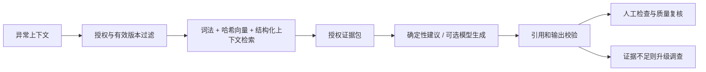

# Manufacturing RCA Evidence Copilot

面向制造良率异常调查的 RAG 原型：根据产品、站点、Failure Code 和版本找到有权限访问的证据，生成可验证的排查建议。

所有数据都是虚构合成数据。项目没有连接真实 SeaTrack 或 Seagate 文档系统，也不代表 Seagate 的内部流程、实施结果或官方产品。

## Problem

同一个故障码可能对应设备、物料或程序变更等不同原因。只按关键词找相似案例容易忽略适用范围、文档有效性和访问权限。这里的目标是让工程师核验证据并决定下一步调查，而不是自动确认根因。

## System


```mermaid
flowchart LR
  A[异常上下文] --> B[授权与有效版本过滤]
  B --> C[词法 + 哈希向量 + 结构化上下文检索]
  C --> D[授权证据包]
  D --> E[确定性建议 / 可选模型生成]
  E --> F[引用和输出校验]
  F --> G[人工检查与质量复核]
  F --> H[证据不足则升级调查]
```

## Engineering decisions

- **Context-aware retrieval**：产品、站点、物料和版本参与相关性判断；同一故障码不直接决定根因。实现见 [retrieval.py](rag_app/retrieval.py)。
- **Authorization-aware evidence**：有效版本与授权证据先被筛选，生成层只能引用当前证据 ID。隐藏 UI 元素不构成授权机制。
- **Deterministic controls**：权限、调查状态和引用校验需要稳定、可测试的规则；模型只能生成候选解释。模型输出错误时回到确定性建议，见 [model gateway](docs/model-gateway.md)。
- **Safe escalation**：证据不足、要求跳测/放行/停线/改工艺参数等情况，交给授权人员。LLM 不直接控制生产操作。

## Evaluation and failure boundaries

2026-09-16 本次复测：**80 项 unittest 通过；24/24 合成评估通过**。评估输入在 [data/evaluations.json](data/evaluations.json)，执行器在 [scripts/evaluate.py](scripts/evaluate.py)。语料包含 30 个合成案例、12 个版本化文档及 240 条小时聚合观测；这组 100% 是受控回归结果，不证明真实根因准确率或工厂效率提升。

测试覆盖上下文排序、授权和输出校验、来源同步与恢复。没有真实工厂人工标注集、LLM 根因准确率基准或线上延迟测量。哈希向量属于演示检索实现，不能视作已验证的语义嵌入模型。

## Trade-offs and limits

确定性组件提供可重复的控制边界，也会受到规则覆盖范围限制。合成资料与测试共享设计假设，不能用满分推导通用表现。当前系统没有证明缩短现场调查时间，缺失证据时需要人类调查。

真实部署还需要：批准的字段与数据契约、真实历史问题标注集、企业身份和来源接入验收、正式嵌入/重排模型、模型网关与密钥管理、集中审计与告警，以及现场基线和效果测量。现有 OIDC/导入适配器的代码不等于这些企业接入已完成。

## Reproduce

```bash
python3 -m unittest discover -s tests -v
python3 scripts/evaluate.py
python3 server.py --host 127.0.0.1 --port 8787 --dev-auth
```

评估使用仓库内合成数据；本次没有调用付费模型或真实工厂系统。完整的 API、OIDC、导入、回滚及环境设置移至 [OPERATIONS.md](OPERATIONS.md)。

## Evidence and integration contracts

- [来源导出契约](docs/source-export-contract.md)
- [模型网关和确定性降级](docs/model-gateway.md)
- [代码级架构导览](docs/architecture-walkthrough.md)
- [身份接入边界](docs/oidc-deployment.md)
- [现场需求访谈](docs/interview-guide.md) — 业务发现材料，非求职问答
- [已有修复记录](docs/security-remediation-2026-07-29.md)

本次文档整理和验证使用 AI 辅助。最终技术判断仍需根据代码、测试、数据来源与具体部署契约审查。
