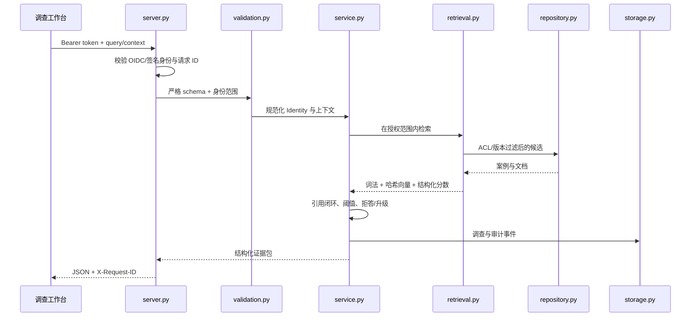
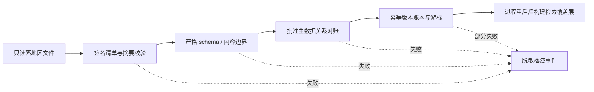

# 代码架构导览

本文帮助第一次阅读仓库的人在 15 分钟内理解核心路径。系统采用确定性、零第三方运行依赖的实现，是为了让安全边界、检索理由和测试结果可以在本机完整复现；它不是对生产技术栈的限制。

## 1. 在线分诊路径

关键顺序是“验证身份 → 校验范围 → 前置 ACL → 检索 → 证据校验 → 持久化”。如果先召回受限内容再从答案中删除，敏感文本已经进入后续上下文，边界就失效了。

## 2. 来源同步路径

`source_operations.py` 负责一次作业的状态和阶段，`source_manifest.py` 只判断交付能否被信任，`ingestion.py` 只判断内容是否符合契约，`reconciliation.py` 判断实体关系是否合法，`storage.py` 原子写入来源账本。分层后，每个失败能落到稳定的阶段和原因码。

## 3. 三类状态不要混在一起

| 状态 | 例子 | 所有者 |
| --- | --- | --- |
| 调查状态 | `TRIAGE → INVESTIGATING → … → PUBLISHED` | 工程师与质量审核人 |
| 知识状态 | `DRAFT / PUBLISHED`、`EFFECTIVE / SUPERSEDED` | 知识所有者 |
| 来源状态 | `COMPLETED / FAILED`、检疫与游标 | 制造 IT / 数据运营 |

调查完成不代表知识自动发布；来源成功也不代表某条根因被人工确认。这个区分防止助手把技术写入成功误当成业务真相。

## 4. 检索和答案为什么是确定性的

当前混合排序使用词法、哈希向量和制造上下文三类信号，权重集中在 `rag_app/retrieval.py`。哈希向量只提供可重复的语义近似，真实项目应通过现场 golden set 比较 BM25、多语言 embedding 和 reranker。

`rag_app/service.py` 不让模型自由生成操作，而是从授权证据编译已知事实、相似案例、差异、检查步骤和升级条件。低于阈值时返回人工升级；要求停线、放行、跳测、报废或改参数时返回受控拒绝。这让 PoC 可以验证“证据是否存在、用户能否打开、版本是否有效”，而不是只看语言是否自然。

## 5. 持久化和并发边界

SQLite 适合单机 PoC 和可重复演示：WAL 允许读取与短写事务更好地并存，`busy_timeout` 避免瞬时锁竞争立刻失败。数据库保存调查、审计、反馈、来源游标、版本历史和检疫元数据，不保存身份 refresh token，也不复制失败导出原文。

生产部署应把 HTTP 服务做成无状态实例，把事务与留存迁移到企业批准的数据库，把日志/Trace 写入集中平台，并用正式调度或消息系统触发来源作业。

## 6. 最明确的生产扩展点

| 当前边界 | 可替换的生产适配器 | 必须保留的不变量 |
| --- | --- | --- |
| 合成 `Repository` | SeaTrack、DMS、PLM/JIRA 只读连接器 | 来源、版本、ACL、撤销可追溯 |
| 哈希向量 | 企业向量库 + 多语言 embedding + reranker | 先过滤权限，后排序 |
| 确定性合成器 | 企业模型网关 + Structured Output | 引用验证、拒答和人工决定 |
| 一次性文件作业 | Kafka/调度器/对象存储事件适配器 | 幂等、重放、游标、检疫 |
| SQLite | 企业关系库与审计平台 | 原子状态机、所有者隔离、留存 |
| 本地/OIDC 验证路径 | 企业 SSO、代理和策略引擎 | issuer/audience/算法固定，失败关闭 |

## 7. 阅读顺序

建议按 `server.py` → `rag_app/validation.py` → `rag_app/service.py` → `rag_app/retrieval.py` → `rag_app/repository.py` → `rag_app/storage.py` 阅读在线路径；再按 `scripts/run_source_sync_job.py` → `rag_app/source_operations.py` → `source_manifest.py` → `ingestion.py` → `reconciliation.py` 阅读数据路径。每读完一条路径，运行对应测试观察真实输入输出，比逐文件通读更快。
