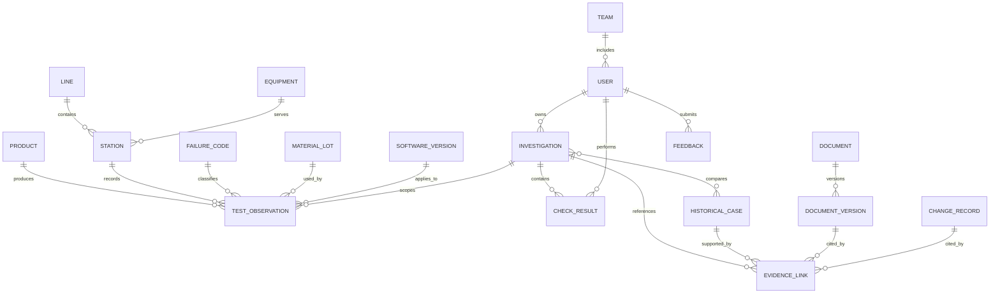

# Seagate Wuxi SelfTest Yield Anomaly Copilot

## 数据需求与数据字典（v0.1）

- 文档状态：讨论稿
- 上游文档：[业务需求文档](./requirements.md)
- 上游文档：[用户故事与业务流程](./user-stories.md)
- 实现契约：[SeaTrack / approved DMS 离线导出 v1](./source-export-contract.md)
- 当前阶段：数据范围、字段定义与合成数据规划
- 说明：本文中的产品、产线、设备、代码、人员和案例均为虚构设计，不代表 Seagate 真实内部数据

## 1. 数据设计目标

MVP 数据需要支持一个核心任务：

> 在 SelfTest 良率异常发生后，根据产品、站点、失败代码、物料和软件版本等上下文，找到真正相似的历史案例，并生成有证据的首轮排查方案。

数据设计必须保证：

1. 同一个 Failure Code 可以对应不同根因；
2. 不同 Failure Code 也可能表现出相似症状；
3. 相似性需要结合产品、站点、设备、物料、版本和时间判断；
4. 历史案例、SOP 和变更记录都有状态与版本；
5. 系统可以区分已审核事实、未审核记录和模型推断；
6. 所有回答都能够追溯到原始证据；
7. 合成数据可以在未来被真实系统数据替换。

## 2. 数据范围

### 2.1 MVP 纳入的数据

- 产品族与产品型号；
- 产线、测试站和设备；
- SelfTest Failure Code；
- 聚合后的测试良率数据；
- 异常调查记录；
- 历史异常案例；
- 检查步骤与执行结果；
- SOP、Failure Code 说明和 FA 报告；
- 物料、固件、测试程序和设备变更记录；
- 用户反馈、审核和审计记录。

### 2.2 MVP 不纳入的数据

- 单块硬盘的完整原始高频测试波形；
- 大规模实时传感器流；
- 真实客户信息；
- 真实员工个人信息；
- 真实供应商名称和商业条款；
- 设备控制指令；
- 产线自动启停数据；
- 视觉检测图片和视频；
- 预测性维护模型训练数据。

## 3. 数据实体关系



## 4. 主数据字典

### 4.1 PRODUCT：产品

| 字段 | 类型 | 必填 | 示例 | 说明 |
| --- | --- | --- | --- | --- |
| product_id | string | 是 | `PRD-HX1001` | 产品唯一编号 |
| product_family | string | 是 | `HDD-X` | 用于跨型号检索的产品族 |
| model_name | string | 是 | `HX-Alpha` | 虚构型号名称 |
| capacity_class | string | 否 | `12TB` | 容量级别，仅用于演示 |
| interface_type | enum | 否 | `SATA` | SATA、SAS 或其他虚构枚举 |
| form_factor | enum | 否 | `3.5-inch` | 产品形态 |
| lifecycle_status | enum | 是 | `ACTIVE` | ACTIVE、PILOT、EOL |
| effective_from | datetime | 是 | `2026-01-01T00:00:00+08:00` | 生效时间 |
| effective_to | datetime | 否 |  | 失效时间 |

数据规则：

- `product_id` 全局唯一；
- EOL 产品仍可用于历史案例检索；
- 当前建议优先引用调查发生时间点有效的产品定义。

### 4.2 LINE：产线

| 字段 | 类型 | 必填 | 示例 | 说明 |
| --- | --- | --- | --- | --- |
| line_id | string | 是 | `LINE-02` | 产线唯一编号 |
| line_name | string | 是 | `Drive Assembly Line 2` | 虚构名称 |
| area | string | 是 | `SelfTest Area A` | 所属区域 |
| status | enum | 是 | `ACTIVE` | ACTIVE、MAINTENANCE、RETIRED |

### 4.3 STATION：测试站

| 字段 | 类型 | 必填 | 示例 | 说明 |
| --- | --- | --- | --- | --- |
| station_id | string | 是 | `ST-04` | 站点唯一编号 |
| line_id | string | 是 | `LINE-02` | 所属产线 |
| station_name | string | 是 | `SelfTest Station 04` | 展示名称 |
| test_stage | string | 是 | `SELFTEST_FINAL` | 测试阶段 |
| equipment_id | string | 是 | `EQ-ST-004` | 当前关联设备 |
| status | enum | 是 | `ACTIVE` | ACTIVE、MAINTENANCE、RETIRED |

### 4.4 EQUIPMENT：设备

| 字段 | 类型 | 必填 | 示例 | 说明 |
| --- | --- | --- | --- | --- |
| equipment_id | string | 是 | `EQ-ST-004` | 设备唯一编号 |
| equipment_type | string | 是 | `SELFTEST_RACK` | 设备类型 |
| equipment_model | string | 否 | `STR-X2` | 虚构设备型号 |
| installation_date | date | 否 | `2024-06-12` | 安装日期 |
| last_calibration_at | datetime | 否 | `2026-07-01T09:00:00+08:00` | 最近校准时间 |
| last_maintenance_at | datetime | 否 | `2026-07-20T11:30:00+08:00` | 最近维护时间 |
| status | enum | 是 | `ACTIVE` | ACTIVE、MAINTENANCE、RETIRED |

### 4.5 FAILURE_CODE：失败代码

| 字段 | 类型 | 必填 | 示例 | 说明 |
| --- | --- | --- | --- | --- |
| failure_code | string | 是 | `F127` | 代码主键 |
| name_en | string | 是 | `Positioning Timeout` | 虚构英文名称 |
| name_zh | string | 是 | `定位超时` | 中文名称 |
| description | text | 是 | `SelfTest 阶段未在规定时间内完成定位` | 代码说明 |
| test_stage | string | 是 | `SELFTEST_FINAL` | 适用测试阶段 |
| severity | enum | 是 | `MEDIUM` | LOW、MEDIUM、HIGH、CRITICAL |
| default_owner_team | string | 否 | `PRODUCT_ENGINEERING` | 默认处理团队 |
| valid_from | datetime | 是 | `2025-01-01T00:00:00+08:00` | 生效时间 |
| valid_to | datetime | 否 |  | 失效时间 |
| source_document_id | string | 是 | `DOC-FC-001` | 权威定义来源 |

数据规则：

- Failure Code 不是根因，只描述测试失败类型；
- 同一 Failure Code 必须允许关联多个历史根因；
- 代码含义随程序版本变化时，必须新增版本或适用条件。

### 4.6 MATERIAL_LOT：物料批次

| 字段 | 类型 | 必填 | 示例 | 说明 |
| --- | --- | --- | --- | --- |
| material_lot_id | string | 是 | `HSA-L2407` | 虚构批次编号 |
| material_type | string | 是 | `HSA` | 物料类别 |
| material_part_number | string | 是 | `PN-HSA-42` | 虚构料号 |
| received_at | datetime | 否 | `2026-07-20T08:00:00+08:00` | 收料时间 |
| supplier_alias | string | 否 | `SUPPLIER-A` | 仅使用虚构别名 |
| quality_status | enum | 是 | `RELEASED` | RELEASED、HOLD、REJECTED |
| applicable_products | array[string] | 是 | `["PRD-HX1001"]` | 适用产品 |

### 4.7 SOFTWARE_VERSION：软件版本

统一表示固件和测试程序版本。

| 字段 | 类型 | 必填 | 示例 | 说明 |
| --- | --- | --- | --- | --- |
| software_version_id | string | 是 | `SW-TP-3.8` | 唯一编号 |
| software_type | enum | 是 | `TEST_PROGRAM` | TEST_PROGRAM、FIRMWARE |
| version | string | 是 | `3.8` | 版本号 |
| status | enum | 是 | `ACTIVE` | DRAFT、PILOT、ACTIVE、RETIRED |
| released_at | datetime | 是 | `2026-07-15T10:00:00+08:00` | 发布时间 |
| applicable_products | array[string] | 是 | `["PRD-HX1001"]` | 适用产品 |
| change_record_id | string | 否 | `CHG-TP-0038` | 关联变更记录 |

## 5. 业务交易数据字典

### 5.1 TEST_OBSERVATION：测试聚合观测

MVP 使用分钟级或小时级聚合数据，不保存真实的单盘完整测试数据。

| 字段 | 类型 | 必填 | 示例 | 说明 |
| --- | --- | --- | --- | --- |
| observation_id | string | 是 | `OBS-20260728-0001` | 唯一编号 |
| window_start | datetime | 是 | `2026-07-28T14:00:00+08:00` | 聚合窗口开始 |
| window_end | datetime | 是 | `2026-07-28T15:00:00+08:00` | 聚合窗口结束 |
| product_id | string | 是 | `PRD-HX1001` | 产品 |
| line_id | string | 是 | `LINE-02` | 产线 |
| station_id | string | 是 | `ST-04` | 测试站 |
| equipment_id | string | 是 | `EQ-ST-004` | 设备 |
| failure_code | string | 是 | `F127` | 失败代码 |
| material_lot_id | string | 否 | `HSA-L2407` | 物料批次 |
| firmware_version_id | string | 否 | `SW-FW-2.1.4` | 固件版本 |
| test_program_version_id | string | 是 | `SW-TP-3.8` | 测试程序版本 |
| units_tested | integer | 是 | `1200` | 测试数量 |
| units_passed | integer | 是 | `1068` | 通过数量 |
| units_failed | integer | 是 | `132` | 失败数量 |
| first_pass_yield | decimal | 是 | `0.89` | 首次通过率，范围 0 到 1 |
| failure_count | integer | 是 | `96` | 该 Failure Code 数量 |
| failure_rate | decimal | 是 | `0.08` | 该 Failure Code 发生率 |
| baseline_failure_rate | decimal | 否 | `0.012` | 对应基线发生率 |
| source_system | string | 是 | `SYNTHETIC_MES` | 数据来源 |
| quality_status | enum | 是 | `VALIDATED` | RAW、VALIDATED、QUESTIONABLE |

校验规则：

- `units_passed + units_failed = units_tested`；
- `first_pass_yield = units_passed / units_tested`，允许定义范围内的舍入误差；
- `failure_count <= units_failed`；
- `window_end > window_start`；
- 同一窗口、产品和站点不可出现重复记录；
- `QUESTIONABLE` 数据不得作为确定性判断的唯一依据。

### 5.2 INVESTIGATION：异常调查

| 字段 | 类型 | 必填 | 示例 | 说明 |
| --- | --- | --- | --- | --- |
| investigation_id | string | 是 | `INV-20260728-001` | 调查编号 |
| title | string | 是 | `HDD-X Station 04 F127 increase` | 标题 |
| raw_description | text | 是 | `14:20 后 F127 明显增加` | 用户原始描述，不覆盖 |
| status | enum | 是 | `TRIAGE` | DRAFT、TRIAGE、INVESTIGATING、CONTAINED、ROOT_CAUSE_CONFIRMED、CLOSED、PUBLISHED |
| severity | enum | 是 | `MEDIUM` | LOW、MEDIUM、HIGH、CRITICAL |
| owner_user_id | string | 是 | `USR-PE-001` | 负责人 |
| owner_team_id | string | 是 | `TEAM-PE` | 负责团队 |
| product_ids | array[string] | 是 | `["PRD-HX1001"]` | 涉及产品 |
| line_ids | array[string] | 否 | `["LINE-02"]` | 涉及产线 |
| station_ids | array[string] | 否 | `["ST-04"]` | 涉及站点 |
| failure_codes | array[string] | 是 | `["F127"]` | 涉及失败代码 |
| material_lot_ids | array[string] | 否 | `["HSA-L2407"]` | 物料批次 |
| firmware_version_ids | array[string] | 否 | `["SW-FW-2.1.4"]` | 固件版本 |
| test_program_version_ids | array[string] | 否 | `["SW-TP-3.8"]` | 测试程序版本 |
| detected_at | datetime | 是 | `2026-07-28T14:20:00+08:00` | 发现时间 |
| created_at | datetime | 是 | `2026-07-28T14:31:00+08:00` | 创建时间 |
| updated_at | datetime | 是 | `2026-07-28T15:10:00+08:00` | 更新时间 |
| closed_at | datetime | 否 |  | 关闭时间 |
| confirmed_root_cause | text | 否 |  | 仅授权人员确认后填写 |
| root_cause_approval_status | enum | 是 | `NOT_CONFIRMED` | NOT_CONFIRMED、PENDING、APPROVED、REJECTED |
| confidentiality | enum | 是 | `INTERNAL` | INTERNAL、RESTRICTED |

### 5.3 CHECK_RESULT：检查项与执行结果

| 字段 | 类型 | 必填 | 示例 | 说明 |
| --- | --- | --- | --- | --- |
| check_result_id | string | 是 | `CHK-INV001-01` | 唯一编号 |
| investigation_id | string | 是 | `INV-20260728-001` | 所属调查 |
| sequence | integer | 是 | `1` | 排查顺序 |
| check_title | string | 是 | `比较其他站点的 F127 分布` | 检查标题 |
| check_purpose | text | 是 | `判断异常是否为站点特有` | 检查目的 |
| evidence_type | enum | 是 | `APPROVED_SOP` | APPROVED_SOP、HISTORICAL_CASE、SYSTEM_INFERENCE |
| source_evidence_ids | array[string] | 否 | `["EV-001"]` | 引用证据 |
| risk_level | enum | 是 | `LOW` | LOW、MEDIUM、HIGH |
| required_role | string | 是 | `PRODUCT_ENGINEER` | 建议执行角色 |
| status | enum | 是 | `COMPLETED` | PROPOSED、ACCEPTED、COMPLETED、NOT_APPLICABLE、REJECTED |
| result | text | 否 | `其他站点未出现相同异常` | 执行结果 |
| performed_by | string | 否 | `USR-PE-001` | 执行人 |
| performed_at | datetime | 否 | `2026-07-28T14:50:00+08:00` | 执行时间 |
| review_status | enum | 是 | `UNREVIEWED` | UNREVIEWED、REVIEWED、REJECTED |

规则：

- 高风险检查必须引用有效流程，并要求人工授权；
- `SYSTEM_INFERENCE` 不能伪装成正式 SOP；
- 结果修改必须保留历史版本。

### 5.4 FEEDBACK：用户反馈

| 字段 | 类型 | 必填 | 示例 | 说明 |
| --- | --- | --- | --- | --- |
| feedback_id | string | 是 | `FDB-0001` | 唯一编号 |
| investigation_id | string | 是 | `INV-20260728-001` | 所属调查 |
| answer_id | string | 是 | `ANS-0001` | 被评价回答 |
| user_id | string | 是 | `USR-PE-001` | 反馈人 |
| rating | enum | 是 | `PARTIALLY_USEFUL` | USEFUL、PARTIALLY_USEFUL、NOT_USEFUL、RISKY |
| reason_codes | array[string] | 否 | `["CASE_NOT_SIMILAR"]` | 原因标签 |
| comment | text | 否 | `产品配置不同，案例不应排第一` | 说明 |
| created_at | datetime | 是 | `2026-07-28T15:05:00+08:00` | 创建时间 |
| resolution_status | enum | 是 | `OPEN` | OPEN、REVIEWED、RESOLVED |

## 6. 知识数据字典

### 6.1 HISTORICAL_CASE：历史异常案例

| 字段 | 类型 | 必填 | 示例 | 说明 |
| --- | --- | --- | --- | --- |
| case_id | string | 是 | `CASE-F127-001` | 案例编号 |
| title | string | 是 | `Station 04 F127 increase after calibration drift` | 案例标题 |
| summary | text | 是 | `单站 F127 升高，最终确认为校准漂移` | 摘要 |
| status | enum | 是 | `PUBLISHED` | DRAFT、UNDER_REVIEW、PUBLISHED、RETIRED |
| product_ids | array[string] | 是 | `["PRD-HX1001"]` | 适用产品 |
| line_ids | array[string] | 否 | `["LINE-01"]` | 涉及产线 |
| station_ids | array[string] | 否 | `["ST-02"]` | 涉及站点 |
| equipment_types | array[string] | 否 | `["SELFTEST_RACK"]` | 设备类型 |
| failure_codes | array[string] | 是 | `["F127"]` | 失败代码 |
| symptoms | array[string] | 是 | `["single_station_spike", "position_timeout"]` | 标准化症状标签 |
| material_lot_ids | array[string] | 否 |  | 相关物料批次 |
| firmware_versions | array[string] | 否 | `["2.1.3"]` | 固件版本 |
| test_program_versions | array[string] | 否 | `["3.7"]` | 测试程序版本 |
| detected_at | datetime | 是 | `2026-05-12T08:20:00+08:00` | 发现时间 |
| impact_summary | text | 是 | `Station 02 FPY decreased` | 影响摘要 |
| checks_performed | array[object] | 是 |  | 排查步骤与结果 |
| excluded_causes | array[string] | 否 | `["HSA_LOT", "FIRMWARE"]` | 已有证据排除的原因 |
| confirmed_root_cause | text | 否 | `测试站校准漂移` | 最终根因 |
| root_cause_category | enum | 否 | `EQUIPMENT` | EQUIPMENT、MATERIAL、PROCESS、FIRMWARE、TEST_PROGRAM、PRODUCT_DESIGN、UNKNOWN |
| containment_action | text | 否 | `暂停该站点并转移测试` | 临时措施，仅作案例事实记录 |
| corrective_action | text | 否 | `按批准流程重新校准并验证` | 永久措施 |
| validation_result | text | 否 | `恢复后连续三个窗口回到基线` | 验证结果 |
| applicable_conditions | array[string] | 是 | `["single_station_only"]` | 适用条件 |
| non_applicable_conditions | array[string] | 否 | `["multi_station_spike"]` | 不适用条件 |
| owner_team_id | string | 是 | `TEAM-PE` | 案例所有者 |
| approved_by | string | 否 | `USR-QA-001` | 审核人 |
| approved_at | datetime | 否 | `2026-05-15T16:00:00+08:00` | 审核时间 |
| confidence | enum | 是 | `CONFIRMED` | CONFIRMED、PROBABLE、UNRESOLVED |
| source_evidence_ids | array[string] | 是 | `["EV-CASE001-FA"]` | 支持证据 |
| confidentiality | enum | 是 | `INTERNAL` | INTERNAL、RESTRICTED |

重要规则：

- `confirmed_root_cause` 只有在 `confidence = CONFIRMED` 且 `status = PUBLISHED` 时，才能作为正式历史根因引用；
- 案例必须同时记录适用和不适用条件；
- `containment_action` 是历史事实，不代表当前用户可以直接执行；
- 案例中的旧操作步骤不能覆盖当前有效 SOP。

### 6.2 DOCUMENT：文档主记录

| 字段 | 类型 | 必填 | 示例 | 说明 |
| --- | --- | --- | --- | --- |
| document_id | string | 是 | `DOC-SOP-ST-001` | 文档编号 |
| document_type | enum | 是 | `SOP` | SOP、FAILURE_CODE_GUIDE、FA_REPORT、EIGHT_D、CHANGE_NOTICE、MAINTENANCE_RECORD |
| title | string | 是 | `SelfTest F127 Initial Triage` | 标题 |
| owner_team_id | string | 是 | `TEAM-PE` | 所有者 |
| confidentiality | enum | 是 | `INTERNAL` | INTERNAL、RESTRICTED |
| source_system | string | 是 | `SYNTHETIC_DMS` | 来源系统 |
| canonical_uri | string | 是 | `synthetic://documents/DOC-SOP-ST-001` | 原文位置 |

### 6.3 DOCUMENT_VERSION：文档版本

| 字段 | 类型 | 必填 | 示例 | 说明 |
| --- | --- | --- | --- | --- |
| document_version_id | string | 是 | `DOC-SOP-ST-001-V2` | 版本唯一编号 |
| document_id | string | 是 | `DOC-SOP-ST-001` | 所属文档 |
| version | string | 是 | `2.0` | 版本号 |
| status | enum | 是 | `EFFECTIVE` | DRAFT、EFFECTIVE、SUPERSEDED、RETIRED |
| language | enum | 是 | `ZH_CN` | ZH_CN、EN_US、BILINGUAL |
| effective_from | datetime | 是 | `2026-06-01T00:00:00+08:00` | 生效时间 |
| effective_to | datetime | 否 |  | 失效时间 |
| approved_by | string | 否 | `USR-QA-001` | 批准人 |
| approved_at | datetime | 否 | `2026-05-28T14:00:00+08:00` | 批准时间 |
| content_path | string | 是 | `knowledge/sop/DOC-SOP-ST-001-V2.md` | 原始内容位置 |
| checksum | string | 是 | `sha256:...` | 内容完整性校验 |
| applicable_products | array[string] | 否 | `["HDD-X"]` | 适用产品族 |
| applicable_failure_codes | array[string] | 否 | `["F127"]` | 适用失败代码 |
| supersedes_version_id | string | 否 | `DOC-SOP-ST-001-V1` | 替代版本 |

时间有效性规则：

- 回答“现在应该怎么做”时，只使用当前 `EFFECTIVE` 文档作为操作依据；
- 回答“历史上当时怎么处理”时，可以引用当时有效版本；
- `SUPERSEDED` 文档必须明确标注，不能作为当前操作依据。

### 6.4 CHANGE_RECORD：变更记录

| 字段 | 类型 | 必填 | 示例 | 说明 |
| --- | --- | --- | --- | --- |
| change_record_id | string | 是 | `CHG-TP-0038` | 变更编号 |
| change_type | enum | 是 | `TEST_PROGRAM` | TEST_PROGRAM、FIRMWARE、MATERIAL、PROCESS、EQUIPMENT |
| title | string | 是 | `Release TP 3.8` | 标题 |
| description | text | 是 | `调整某 SelfTest 检查逻辑` | 变更摘要 |
| affected_products | array[string] | 是 | `["PRD-HX1001"]` | 影响产品 |
| affected_lines | array[string] | 否 | `["LINE-01", "LINE-02"]` | 影响产线 |
| effective_at | datetime | 是 | `2026-07-15T10:00:00+08:00` | 生效时间 |
| rollback_at | datetime | 否 |  | 回退时间 |
| status | enum | 是 | `ACTIVE` | PLANNED、ACTIVE、ROLLED_BACK、CLOSED |
| owner_team_id | string | 是 | `TEAM-TEST` | 负责团队 |
| approval_status | enum | 是 | `APPROVED` | DRAFT、PENDING、APPROVED、REJECTED |
| validation_summary | text | 否 | `Pilot validation passed` | 验证摘要 |
| related_document_ids | array[string] | 否 | `["DOC-CHG-0038"]` | 关联文档 |

### 6.5 EVIDENCE_LINK：证据引用

| 字段 | 类型 | 必填 | 示例 | 说明 |
| --- | --- | --- | --- | --- |
| evidence_id | string | 是 | `EV-CASE001-FA` | 证据编号 |
| source_type | enum | 是 | `DOCUMENT_VERSION` | DOCUMENT_VERSION、CASE、CHANGE_RECORD、TEST_OBSERVATION、CHECK_RESULT |
| source_id | string | 是 | `DOC-FA-001-V1` | 来源对象编号 |
| locator | string | 是 | `section:Root Cause` | 原文定位信息 |
| excerpt | text | 否 | `校准结果超出允许范围……` | 短证据片段 |
| claim_supported | text | 是 | `支持测试站校准漂移结论` | 所支持的结论 |
| evidence_status | enum | 是 | `VALID` | VALID、EXPIRED、CONFLICTING、UNREVIEWED |
| captured_at | datetime | 是 | `2026-07-28T14:45:00+08:00` | 引用时间 |
| access_policy_id | string | 是 | `POL-INTERNAL-PE-QA` | 权限规则 |

规则：

- `locator` 必须足以让用户回到具体证据位置；
- 引用片段不能脱离原文语境；
- 权限失效后，不得继续向无权用户展示缓存片段；
- 同一结论存在冲突证据时，两者都应保留。

## 7. 身份、团队与权限数据

### 7.1 USER

MVP 使用虚构账号，不保存真实个人信息。

| 字段 | 类型 | 必填 | 示例 | 说明 |
| --- | --- | --- | --- | --- |
| user_id | string | 是 | `USR-PE-001` | 用户编号 |
| display_name | string | 是 | `Product Engineer A` | 虚构展示名 |
| team_id | string | 是 | `TEAM-PE` | 所属团队 |
| roles | array[string] | 是 | `["PRODUCT_ENGINEER"]` | 角色 |
| status | enum | 是 | `ACTIVE` | ACTIVE、DISABLED |

### 7.2 TEAM

| 字段 | 类型 | 必填 | 示例 | 说明 |
| --- | --- | --- | --- | --- |
| team_id | string | 是 | `TEAM-PE` | 团队编号 |
| team_name | string | 是 | `Product Engineering` | 团队名称 |
| data_domains | array[string] | 是 | `["PRODUCT", "TEST"]` | 可访问数据域 |

### 7.3 ACCESS_POLICY

| 字段 | 类型 | 必填 | 示例 | 说明 |
| --- | --- | --- | --- | --- |
| access_policy_id | string | 是 | `POL-INTERNAL-PE-QA` | 权限规则编号 |
| allowed_roles | array[string] | 是 | `["PRODUCT_ENGINEER", "QUALITY_ENGINEER"]` | 允许角色 |
| allowed_teams | array[string] | 否 | `["TEAM-PE", "TEAM-QA"]` | 允许团队 |
| denied_actions | array[string] | 否 | `["DOWNLOAD"]` | 禁止动作 |
| effective_from | datetime | 是 | `2026-01-01T00:00:00+08:00` | 生效时间 |
| effective_to | datetime | 否 |  | 失效时间 |

## 8. 标准术语与别名

为了支持中英文和现场缩写检索，MVP 需要术语表。

| canonical_term | term_type | aliases | 示例说明 |
| --- | --- | --- | --- |
| `SELFTEST_FINAL` | TEST_STAGE | `SelfTest`, `自测试`, `ST Final` | 同一测试阶段的不同叫法 |
| `POSITIONING_TIMEOUT` | SYMPTOM | `定位超时`, `servo timeout`, `F127` | 代码与现象关联，但不等同根因 |
| `TEST_PROGRAM` | SOFTWARE_TYPE | `TP`, `test code`, `测试程序` | 测试程序别名 |
| `HEAD_STACK_ASSEMBLY` | MATERIAL_TYPE | `HSA`, `磁头堆栈组件` | 物料名称 |
| `FIRST_PASS_YIELD` | METRIC | `FPY`, `首次通过率`, `一遍良率` | 指标别名 |

术语规则：

- 别名用于提高检索召回率；
- 系统展示时保留原文术语；
- 不允许因为术语相似就推断根因相同；
- Failure Code 与症状、根因必须分别建模。

## 9. 合成数据集规划

### 9.1 建议规模

| 数据对象 | MVP 数量 | 目的 |
| --- | ---: | --- |
| 产品族 | 3 | 验证产品范围过滤 |
| 产品型号 | 5 | 验证同族与跨族相似性 |
| 产线 | 2 | 验证单线与跨线异常 |
| 测试站 | 6 | 验证单站和多站分布 |
| 设备 | 6 | 验证设备历史关联 |
| Failure Code | 8 | 构造相同代码不同根因 |
| 物料批次 | 12 | 构造批次集中异常 |
| 固件版本 | 4 | 验证版本相关性 |
| 测试程序版本 | 5 | 验证程序变更关联 |
| 测试聚合观测 | 200 至 300 | 构造时间和站点趋势 |
| 历史异常案例 | 30 | 支持相似案例检索 |
| SOP 与代码说明 | 10 至 12 | 支持当前操作依据和版本冲突 |
| FA、8D 和变更资料 | 12 至 15 | 支持根因证据和变更分析 |
| 标准评测问题 | 20 至 30 | 评估检索、引用和拒答 |

### 9.2 核心案例簇 A：单站设备问题

共同特征：

- Failure Code：`F127`；
- 主要表现：定位超时；
- 仅一个 Station 显著升高；
- 其他站点保持正常；
- 最终根因：测试站校准漂移或夹具连接问题；
- 根因类别：`EQUIPMENT`。

该案例簇用于验证系统是否把“单站集中”作为重要相似条件。

### 9.3 核心案例簇 B：物料批次问题

共同特征：

- Failure Code：同样为 `F127`；
- 多个 Station 同时出现；
- 异常集中在特定 `HSA` 批次；
- 更换或隔离批次后恢复；
- 最终根因类别：`MATERIAL`。

该案例簇用于防止系统看到 `F127` 就直接判断设备故障。

### 9.4 核心案例簇 C：测试程序版本问题

共同特征：

- Failure Code：同样为 `F127`；
- 多条产线在程序升级后出现；
- 与单一设备或物料批次无关；
- 程序回退或修订后恢复；
- 最终根因类别：`TEST_PROGRAM`。

该案例簇用于验证系统能否结合变更时间线进行排序。

### 9.5 干扰案例簇 D：症状相似但 Failure Code 不同

共同特征：

- Failure Code 为 `F131` 或其他虚构代码；
- 文本中也可能出现“timeout”或“position”；
- 实际原因与 `F127` 不同；
- 用于检验语义检索是否过度召回。

### 9.6 无答案案例簇 E

设计一种新失败模式：

- 历史案例中没有对应产品和失败模式；
- 只有通用 SOP；
- 系统应明确资料不足并建议升级；
- 不得从相似词拼出虚构根因。

### 9.7 冲突资料案例簇 F

设计以下冲突：

- 历史案例引用 SOP V1；
- 当前有效 SOP 为 V2；
- V1 与 V2 的某一步骤不同；
- 系统应优先使用 V2，同时说明历史案例当时使用 V1；
- 不得把两套步骤混合成新的操作流程。

## 10. 合成案例示例

```json
{
  "case_id": "CASE-F127-001",
  "title": "Single-station F127 increase caused by calibration drift",
  "status": "PUBLISHED",
  "product_ids": ["PRD-HX1001"],
  "line_ids": ["LINE-01"],
  "station_ids": ["ST-02"],
  "equipment_types": ["SELFTEST_RACK"],
  "failure_codes": ["F127"],
  "symptoms": ["single_station_spike", "position_timeout"],
  "firmware_versions": ["2.1.3"],
  "test_program_versions": ["3.7"],
  "excluded_causes": ["HSA_LOT", "FIRMWARE"],
  "confirmed_root_cause": "Synthetic test station calibration drift",
  "root_cause_category": "EQUIPMENT",
  "applicable_conditions": ["single_station_only"],
  "non_applicable_conditions": ["multi_station_spike"],
  "confidence": "CONFIRMED",
  "source_evidence_ids": ["EV-CASE001-FA"],
  "confidentiality": "INTERNAL"
}
```

## 11. 评测标注数据

每个标准评测问题需要保存以下标签：

| 字段 | 说明 |
| --- | --- |
| evaluation_id | 评测编号 |
| user_query | 用户问题 |
| user_role | 测试权限角色 |
| expected_entities | 应识别的产品、站点、代码、版本等实体 |
| required_context | 回答前必须具备的信息 |
| expected_case_ids | 应优先召回的历史案例 |
| acceptable_case_ids | 可以召回但不应排第一的案例 |
| forbidden_case_ids | 不应因关键词相同而错误引用的案例 |
| expected_document_version_ids | 应引用的有效文档版本 |
| forbidden_document_version_ids | 不得作为当前操作依据的版本 |
| expected_answer_points | 回答必须包含的要点 |
| forbidden_claims | 不允许出现的确定性结论 |
| expected_uncertainty | 是否必须提示信息不足或冲突 |
| expected_action | ANSWER、ASK_FOR_CONTEXT、ESCALATE、REFUSE |
| evaluator_notes | 人工评审说明 |

### 11.1 评测类型分布

建议至少包含：

- 6 个标准有答案问题；
- 4 个同代码不同根因问题；
- 3 个上下文不足问题；
- 2 个无答案问题；
- 2 个文档版本冲突问题；
- 2 个越权问题；
- 1 个高风险操作请求。

## 12. 数据质量规则

### 12.1 完整性

- 已发布案例必须包含症状、排查过程、根因状态和证据；
- 已确认根因必须具有至少一项有效证据；
- SOP 文档必须具有版本、状态和生效时间；
- 测试观测必须具有产品、站点、时间窗口和来源。

### 12.2 一致性

- 产品、站点、设备和 Failure Code 必须引用主数据；
- 所有时间使用带时区的 ISO 8601 格式；
- 枚举值统一使用大写英文代码；
- 中文和英文名称通过术语表关联；
- 同一对象不能同时处于互斥状态。

### 12.3 准确性

- 聚合测试数值满足数量和比例校验；
- 案例根因与证据内容一致；
- 变更生效时间必须与版本发布时间相符；
- 失效文档不能标记为当前有效。

### 12.4 可追溯性

- 每个引用都具有来源、定位和访问策略；
- 每次案例修改保留版本；
- 每次回答保留使用的证据版本；
- 每次审核记录审核人、时间和结果。

### 12.5 去重

可能重复的案例不能仅按标题判断，应综合：

- 产品与时间范围；
- Failure Code；
- 站点和设备；
- 物料批次；
- 调查编号；
- 最终根因与证据。

## 13. 数据安全要求

- 合成数据不得使用真实员工姓名、工号或联系方式；
- 不使用真实客户、供应商或产品内部代号；
- 不复制真实 Seagate 内部 SOP、工艺参数或测试阈值；
- 所有合成文档页面显著标记 `SYNTHETIC DEMO DATA`；
- 对受限案例，权限过滤发生在检索前；
- 缓存、日志和评测输出遵守同一权限规则；
- 不在模型提示或错误信息中泄露无权文档标题；
- 后续接入真实数据时，先完成数据分类和脱敏评审。

## 14. 数据验收标准

合成数据集完成时必须通过：

1. 所有 ID 唯一且引用完整；
2. 所有枚举值符合数据字典；
3. 测试数量与良率计算一致；
4. 每个已发布案例至少具有一项有效证据；
5. 每个 Failure Code 至少有一个权威说明来源；
6. 至少三个 `F127` 案例具有不同根因类别；
7. 至少一个案例包含明确不适用条件；
8. 至少一组文档包含有效版本与失效版本；
9. 至少一个问题没有可靠历史答案；
10. 至少一个受限案例可用于权限测试；
11. 数据中不出现真实个人、客户或供应商信息；
12. 评测问题能够映射到明确的期望证据和禁止结论。

## 15. 当前数据结论

MVP 的检索对象不能只是散乱 PDF。它至少需要同时处理三种数据：

1. **结构化制造上下文**：产品、站点、Failure Code、批次、版本和良率；
2. **结构化历史案例**：症状、排查、根因、适用条件和审核状态；
3. **版本化工程文档**：SOP、代码说明、FA 报告和变更记录。

后续系统能否正确判断“哪个案例更相似”，主要取决于这些上下文字段和证据关系，而不是仅取决于所选的大模型。

下一步应按照本数据字典生成第一批合成主数据、历史案例、文档和评测问题。
