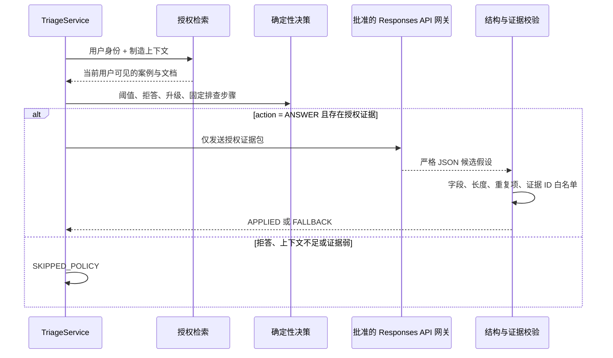

# 可选模型网关与结构化生成边界

本项目默认使用确定性证据合成，因此克隆仓库后不需要 API Key 也能运行全部功能。开启模型网关后，系统会在检索、权限、版本、证据阈值和高风险策略全部通过之后，额外生成一组“候选假设”；模型不会接管调查决策、排查步骤或审批流程。

## 1. 在线调用顺序



这条边界有三个不变量：

1. 权限过滤发生在模型调用之前，受限内容不会先进入提示词再从答案中删除；
2. 模型只能增加 `generated_analysis`，不能修改 `decision`、`triage_steps`、`escalation` 或 `citations`；
3. 超时、HTTP 错误、拒答、非 JSON、额外字段、超长内容或未知证据 ID 都会自动降级到确定性结果，调查记录仍然写入。

## 2. 启用方式

使用企业批准的密钥注入方式设置以下环境变量：

```bash
RAG_GENERATION_MODE='responses-api' \
RAG_MODEL_GATEWAY_URL='https://approved-model-gateway.example/v1/responses' \
RAG_MODEL_GATEWAY_TOKEN='read-from-your-secret-manager' \
RAG_MODEL_NAME='approved-model-deployment' \
RAG_MODEL_GATEWAY_TIMEOUT_SECONDS='12' \
python3 server.py --host 127.0.0.1 --port 8787 --dev-auth
```

配置说明：

| 变量 | 行为 |
| --- | --- |
| `RAG_GENERATION_MODE` | 默认 `deterministic`；只有 `responses-api` 会发送模型请求 |
| `RAG_MODEL_GATEWAY_URL` | 默认 OpenAI Responses API 地址；也可指向兼容的企业网关 |
| `RAG_MODEL_GATEWAY_TOKEN` | 必需的 Bearer token；不要写入仓库或日志 |
| `RAG_MODEL_NAME` | 必需的模型或企业部署名称；代码不写死供应商模型 |
| `RAG_MODEL_GATEWAY_TIMEOUT_SECONDS` | 1–30 秒，默认 12 秒 |

明文 HTTP 只允许 loopback 地址，方便本地契约测试；其他地址必须使用 HTTPS。客户端拒绝重定向，限制响应大小，要求 UTF-8 JSON，并发送 `store: false`。真实企业网关还应完成出站网络白名单、证书/私有 CA、密钥轮换、审计、数据驻留、DLP 和供应商审批。

如果直接使用 OpenAI，调用采用官方 Responses API 的 `text.format.type = json_schema` 和 `strict = true` 结构。实现依据是 [OpenAI Structured Outputs guide](https://developers.openai.com/api/docs/guides/structured-outputs)；是否允许真实制造数据进入任何外部服务，必须由企业安全、法务和数据治理团队决定。

## 3. 模型可以返回什么

模型输出只包含：

```json
{
  "summary": "基于当前证据的保守摘要",
  "hypotheses": [
    {
      "label": "候选方向",
      "analysis": "支持点、差异和不确定性",
      "supporting_evidence_ids": ["DOC-..."],
      "contradicting_evidence_ids": []
    }
  ],
  "missing_information": ["还需要补充的现场信息"]
}
```

服务端再次执行应用层校验，即使上游声称已启用严格结构化输出也不例外。证据 ID 必须属于当前响应的 `citations`；同一证据不能同时支持和反驳一个假设；候选文本再次经过只读生产控制策略，出现跳测、改参数、放行、报废、停线或联锁操作语义会整体降级。当前验证证明的是“引用存在且有权访问”，不是自动证明自然语言陈述与证据语义完全一致，因此界面始终要求工程师复核。

## 4. 运行状态与故障语义

每个答案的 `metrics` 包含：

- `generation_mode`：当前生成适配器；
- `generation_status=DISABLED`：默认确定性模式；
- `generation_status=APPLIED`：结构和证据 ID 校验通过；
- `generation_status=SKIPPED_POLICY`：拒答、升级或上下文不足，模型未被调用；
- `generation_status=FALLBACK`：模型不可用或输出未通过校验，已使用确定性结果。

`GET /api/health` 只暴露生成模式，不暴露端点、token、模型响应或内部错误。上游异常不会把原始错误内容返回浏览器。

## 5. 本地验证

```bash
python3 -m unittest tests.test_generation -v
make check
```

测试包含真实 loopback HTTP 契约，验证 Authorization header、`store: false`、严格 JSON Schema、结构解析和证据 ID 白名单；同时覆盖模型拒答、未完成响应、超范围配置、降级持久化，以及高风险请求不调用模型。
