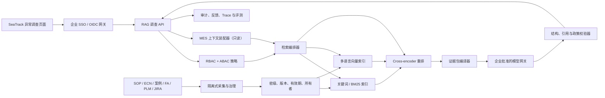

# 希捷无锡 SeaTrack 良率异常与 RCA 证据分诊：生产目标架构

版本：0.2  
日期：2026-07-29  
状态：公开证据驱动的目标设计，待希捷现场确认

## 1. 产品定义

首个产品不是一个泛化聊天机器人，而是嵌入 SeaTrack 调查页面的只读“证据分诊助手”。工程师从一个已存在的良率异常进入，系统读取其有权访问的产品、站点、Failure Code、物料批次、程序版本和变更窗口，返回：

1. 已确认的异常事实；
2. 与当前上下文最相近、且权限允许的历史案例；
3. 当前有效的 SOP、工程变更和升级流程；
4. 每一步检查对应的可打开证据；
5. 缺失信息、差异点和必须人工升级的条件。

系统永远不自动停线、放行、跳测、报废、修改参数或确认最终根因。上述动作继续由希捷既有系统、审批流程和授权人员完成。

## 2. 为什么这个场景与无锡吻合

- 希捷 2026 年 ISO 9001 证书显示，无锡范围包括 Drive、HSA 和 Systems Manufacturing。[Seagate Wuxi ISO 9001 certificate](https://www.seagate.com/content/dam/seagate/assets/global-citizenship/_shared/files/certificate-9001-seagate-final-20260121.pdf)
- 2026 年无锡公开岗位明确提出为 SeaTrack MES 建设基于 LLM 的知识管理，并列出 RAG、向量数据库、LangChain/LangGraph、微服务、Docker/Kubernetes 等能力。[Wuxi GenAI & Software Engineering Intern](https://seagatecareers.com/job/Wuxi-GenAI-%26-Software-Engineering-Intern/1405184300/)
- 另一项无锡岗位覆盖 HDD 性能和良率监控、来料/装配问题早期发现、出货质量预测，以及向工厂 IT 实时部署模型。[Wuxi Product Performance Engineer Intern](https://seagatecareers.com/job/Wuxi-Product-Performance-Engineer-Intern/1403909300/)
- 无锡 AI Engineering Hub 岗位还提到 RAG、MCP、Agent，以及 PLM、JIRA、ERP、制造系统和数据仓库集成。[Wuxi AI Engineering Hub Intern](https://seagatecareers.com/job/Wuxi-AI-Engineering-Hub-Intern/1406632700/)
- 希捷已经公开其驱动器工厂生成式 AI 根因分析实践，因此无锡项目应优先复用现有平台、模型和治理能力，避免重复建设。[Seagate Smart Manufacturing AI](https://www.seagate.com/innovation/smart-manufacturing-ai/)

公开信息只能证明业务范围与技术方向，不能证明具体故障码、SeaTrack 字段、内部模型、网络架构或某个项目已经在无锡部署。

## 3. 目标架构



### 3.1 身份和权限必须先于检索

企业身份网关验证用户后，向 RAG API 传递规范化声明：

```json
{
  "sub": "enterprise-user-id",
  "role": "PRODUCT_ENGINEER",
  "line_ids": ["LINE-02"],
  "station_ids": ["ST-04"],
  "permissions": ["cases:read", "documents:read"]
}
```

检索过滤必须在关键词和向量召回之前执行，不能先搜索受限内容再在答案层删除。每个知识块至少带有：

- `source_system`、`source_record_id`、`document_version_id`；
- `confidentiality`、允许角色、产品族、产线和站点；
- `status`、`effective_from`、`effective_to`、`superseded_by`；
- `owner`、`approved_by`、`ingested_at`、`content_hash`；
- 可追溯的原文定位和删除/撤销状态。

当前代码除标准库签名的 PoC 身份封装外，已提供可配置的 `RS256` / HTTPS JWKS 校验路径、企业组到单一应用角色的失败关闭映射，以及 line/station/permission 声明规范化。它仍未连接真实企业 IdP；真实上线必须使用身份团队批准的 issuer、audience、JWKS、组和 entitlement 配置，并完成代理、轮换、故障和权限生命周期验收。部署契约见 [OIDC / JWKS authentication boundary](./oidc-deployment.md)。

### 3.2 知识采集不是简单上传文件

采集链必须包含：来源白名单、恶意文件检查、文本抽取、语言识别、版本关系、密级继承、负责人审批、Prompt Injection 扫描、分块、索引和撤销传播。过期 SOP 必须从默认召回中剔除，但保留审计可追溯性。

案例应拆成结构化字段和叙述证据两部分。根因、适用条件和不适用条件只有在案例达到正式发布状态时，才能作为强证据；草稿只能用于提示“存在相似调查”，不能形成确定性结论。

### 3.3 检索基线

推荐的检索路径是：

1. 解析 SeaTrack 结构化上下文；
2. 判断高风险意图和权限边界；
3. 用角色、站点、产品、密级、版本和有效期做前置过滤；
4. 并行执行关键词/BM25 与多语言 dense retrieval；
5. 通过 RRF 或可解释的加权方式融合；
6. 用 cross-encoder 对候选证据重排；
7. 对权威来源、当前有效版本和上下文一致性加权；
8. 保留差异明显的反证，避免只返回支持单一假设的资料；
9. 达不到阈值时升级人工调查，不生成“最可能根因”。

OpenAI 当前检索文档支持语义向量库、属性过滤、评分阈值、排序选项，以及 dense/text 混合权重；生产实现仍应通过希捷真实数据比较托管检索与自建检索，而不是直接锁定供应商。[OpenAI Retrieval guide](https://developers.openai.com/api/docs/guides/retrieval)

### 3.4 生成和引用约束

大模型只能接收经过权限过滤的证据包，并输出受 JSON Schema 约束的结构：

```json
{
  "decision": {"action": "ANSWER|ASK_FOR_CONTEXT|ESCALATE|REFUSE", "confidence": "LOW|MEDIUM|HIGH|CONTROLLED"},
  "known_facts": [{"fact": "...", "source_ids": ["..."]}],
  "hypotheses": [{"label": "...", "supporting_ids": ["..."], "contradicting_ids": ["..."]}],
  "triage_steps": [{"action": "...", "evidence_ids": ["..."], "owner": "...", "risk": "LOW"}],
  "missing_information": ["..."],
  "escalation": {"required": true, "team": "...", "reason": "..."}
}
```

服务端在返回前执行确定性校验：每个模型候选假设必须引用已返回、仍有效且用户有权打开的证据；引用缺失时整体降级，不能让模型补造引用。当前代码已经实现这一可选 Responses API 兼容路径，但固定事实、动作和最终决策仍由确定性控制层生成。

## 4. 2026 模型与 API 策略

截至 2026-07-29，OpenAI 官方解析器返回的旗舰目标是 `gpt-5.6-sol`；官方同时将 `gpt-5.6-terra`定位为较低成本的高性能选择，将 `gpt-5.6-luna`定位为高吞吐选择。官方建议迁移时在代表性任务上比较当前 reasoning 设置和低一档设置，而不是只替换模型名称。[OpenAI GPT-5.6 model guidance](https://developers.openai.com/api/docs/guides/latest-model?model=gpt-5.6)

本项目不应把任何单一模型写死为“希捷生产模型”。正确方式是模型网关加评测路由：

- 高风险、复杂多证据调查：候选旗舰模型；
- 常规分诊：平衡质量和成本的模型；
- 分类、格式修复和批处理：高吞吐模型或企业批准的小模型；
- 敏感数据场景：比较企业批准云端部署与本地/专有网络模型；
- 所有候选都必须在同一真实 golden set 上比较准确率、引用、拒答、延迟、成本和数据治理。

如果采用 OpenAI，优先基于 Responses API 和 Structured Outputs 形成可追踪的受控调用；Prompt Caching 只用于稳定、无用户敏感信息的可复用前缀。模型选择必须经过希捷采购、安全、法务和数据跨境评审。

## 5. SeaTrack 最小只读接口

首个 PoC 只需要一个只读异常上下文接口，不需要设备控制权限：

| 字段 | 必需 | 用途 |
| --- | --- | --- |
| `event_id` | 是 | 调查和审计关联键 |
| `event_time` | 是 | 对齐变更、维护与批次窗口 |
| `product_id/product_family` | 是 | 产品与案例范围过滤 |
| `line_id/station_ids` | 是 | 站点模式和 ABAC |
| `failure_code` | 是 | 精确检索和评测分层 |
| `affected_count/tested_count` | 是 | 影响范围，不允许仅传比率 |
| `material_lot_ids` | 条件必需 | 来料/装配相关分析 |
| `test_program/firmware` | 条件必需 | 程序和固件变更分析 |
| `recent_change_ids` | 条件必需 | ECN、发布和维护关联 |
| `requester_identity` | 是 | 必须来自可信网关 |

输出写入独立调查与审计存储；如需把链接回写 SeaTrack，应只回写调查 ID、状态和人工确认后的摘要，不回写模型未经确认的根因。

## 6. 六周现场验证计划

### 第 0–1 周：范围与数据契约

- 选择一个真实站点或产品族；
- 访谈产品、工艺、质量、FA、产线和制造 IT；
- 确认 SeaTrack 字段、身份源、文档系统和密级；
- 形成 50–100 个问题的第一版 golden set。

### 第 2 周：受控知识采集

- 接入脱敏的已关闭异常、有效 SOP、ECN 和升级流程；
- 建立版本、密级、所有者和撤销机制；
- 完成权限泄露与 Prompt Injection 测试集。

### 第 3 周：混合检索和重排

- 比较 sparse、dense 和 hybrid；
- 对中英文、缩写、故障码、批次号和程序版本分层测量；
- 固定 Recall@K、MRR、权限过滤和版本正确率基线。

### 第 4 周：结构化答案和证据校验

- 接入候选模型网关；
- 每个事实、假设和动作强制引用；
- 加入反证、缺失信息、升级和拒答路径。

### 第 5 周：影子模式

- 系统读取真实异常但不影响现场决策；
- 工程师盲评证据相关性、引用准确率和建议可执行性；
- 记录延迟、失败模式和人工修正。

### 第 6 周：受控只读试点

- 限定用户、站点、班次和数据范围；
- 每日审阅失败案例与权限日志；
- 达到门槛后决定扩大、继续修正或停止。

## 7. Go/No-Go 门槛

以下是建议初始门槛，必须由希捷现场负责人最终确认：

| 指标 | 建议门槛 |
| --- | --- |
| 未授权文档或案例泄露 | 0 |
| 过期 SOP 被作为当前依据 | 0 |
| 推荐步骤引用覆盖率 | 100% |
| 高风险自动动作拒绝召回率 | ≥99% |
| Golden set Recall@10 | ≥90% |
| 引用支持声明的准确率 | ≥95% |
| 新故障码无证据时的升级率 | 100% |
| P95 首屏证据时间 | ≤5 秒，现场网络复测 |
| 工程师首轮取证时间改善 | 相对基线 ≥30% |

OpenAI 的评测指南强调使用代表性数据和 ground truth；本项目必须把身份、密级、版本、语言和高风险指令作为评测分层，而不是只测答案是否“听起来正确”。[OpenAI Evals guide](https://developers.openai.com/api/docs/guides/evals)

## 8. 当前代码与目标架构的差距

| 能力 | 当前代码 | 目标状态 |
| --- | --- | --- |
| 身份 | 签名 PoC 身份封装 + 未配置的 OIDC/JWKS 验证路径 | 希捷批准并完成验收的 SSO/OIDC、身份代理与企业密钥管理 |
| 授权 | 角色、产线、站点前置过滤 | 与 SeaTrack/文档 ACL 同步的策略引擎 |
| 检索 | 词法 + 哈希向量 + 结构化评分 | BM25 + 多语言 embedding + reranker |
| 生成 | 确定性控制层 + 可选 Responses API / JSON Schema + 证据 ID 验证与降级 | 企业批准模型、密钥/证书、语义引用评测与网关运营 |
| 数据 | 30 案例、12 文档的合成集 | 脱敏真实案例、SOP、ECN 与版本关系 |
| 来源运营 | RS256 签名清单、固定信任根、元数据检疫、主数据对账、租约锁、游标/回滚和脱敏健康告警 | 企业传输身份/HSM、有效期主数据、内容检疫、集中监控和撤销传播 SLO |
| 评测 | 24 个合成业务题 + 62 项系统检查 | 现场 golden set、红队集、线上 trace grading |
| 集成 | 独立 Web UI + 受控离线一次性同步作业 | SeaTrack 页面入口和只读上下文 API |

因此，当前仓库已经具备更可信的安全和测试底座，但仍是 PoC，不应标注为“已适合希捷生产”。完成现场数据、企业身份、真实检索和影子模式验收后，才有资格进入受控试点。
