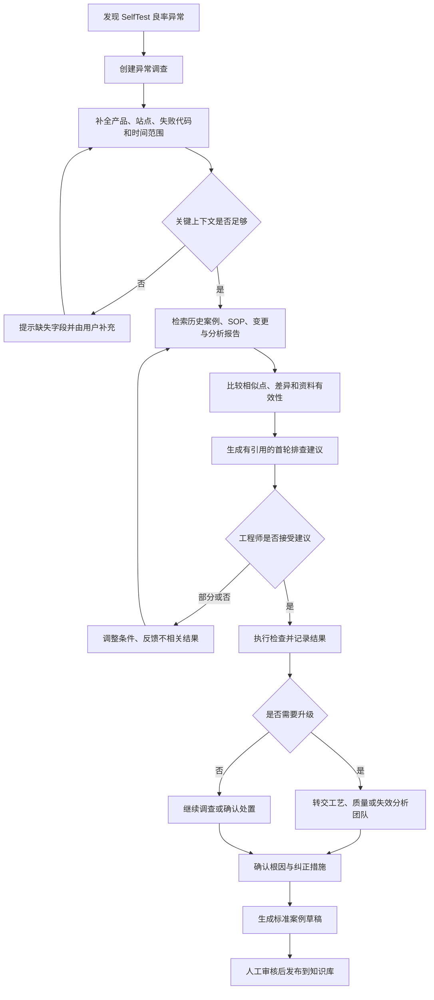

# Seagate Wuxi SelfTest Yield Anomaly Copilot

## 用户故事与业务流程（v0.1）

- 文档状态：讨论稿
- 上游文档：[业务需求文档](./requirements.md)
- 当前阶段：用户故事与目标业务流程
- 说明：人物、产品、产线、失败代码和数据均为虚构演示，不代表 Seagate 的真实内部信息

## 1. 本阶段目标

本阶段回答五个问题：

1. 谁在什么情况下使用系统？
2. 用户需要提供哪些信息？
3. 系统在异常处理流程中具体帮助什么？
4. 哪些判断必须由人完成？
5. 怎样判断一次使用成功结束？

本阶段不决定大模型、向量数据库、部署平台或系统接口。

## 2. 核心业务故事

### 2.1 虚构场景

2026 年 7 月 28 日 14:20，Line 2 的 SelfTest Station 04 开始出现 Failure Code `F127`。产品族 `HDD-X` 的一小时滚动 First Pass Yield 从正常区间下降。该批次使用物料批次 `HSA-L2407`，测试程序版本为 `TP-3.8`。

产品工程师需要尽快回答：

- 异常是否只发生在 Station 04？
- 历史上有没有相似案例？
- 最近是否存在程序、物料、设备或工艺变更？
- 应先排查哪几个方向？
- 是否需要通知质量、工艺或失效分析团队？

### 2.2 业务目标

系统不负责直接给出最终根因，而应帮助产品工程师在一次查询中获得：

- 完整的异常上下文；
- 有解释的相似历史案例；
- 当前适用的 SOP 和 Failure Code 资料；
- 按优先级排列的首轮检查建议；
- 缺失信息和不确定性；
- 原始证据和建议升级路径。

### 2.3 成功结束条件

一次“首轮排查”在满足以下条件时视为完成：

1. 已确认异常基本范围，例如单站、多站、单批次或跨批次；
2. 已找到并审核最相关的历史案例，或明确确认暂无可靠案例；
3. 已形成有负责人和顺序的首轮检查清单；
4. 每项关键建议均有证据，或明确标为系统推断；
5. 已明确下一次检查结果应由谁录入；
6. 对需要升级的情况，已明确升级对象和触发原因。

最终根因不要求在首轮排查阶段确认。

## 3. 用户角色与职责边界

### 3.1 产品工程师——首轮排查负责人

主要职责：

- 发起异常查询；
- 确认产品、站点、失败代码和时间范围；
- 审阅相似案例及系统建议；
- 分配或执行首轮检查；
- 决定是否升级给其他专业团队。

不得由系统替代的判断：

- 是否认定某项因素为最终根因；
- 是否改变测试流程；
- 是否对产品采取隔离、放行或报废措施。

### 3.2 工艺工程师——工艺与物料调查者

主要职责：

- 判断工艺参数、配置和物料批次的相关性；
- 执行获批准的工艺检查；
- 记录检查结果和排除结论；
- 审核涉及工艺的历史案例是否适用于本次异常。

### 3.3 质量工程师——质量风险控制者

主要职责：

- 判断异常影响范围和质量风险；
- 决定是否启动正式质量流程；
- 审核临时处置和纠正措施；
- 确认案例是否可以作为正式质量知识发布。

### 3.4 失效分析工程师——根因验证者

主要职责：

- 对选定样品开展失效分析；
- 设计或执行根因验证实验；
- 对候选根因提供支持或排除证据；
- 输出经过审核的分析结论。

### 3.5 线长或班组负责人——异常发现与补充信息提供者

主要职责：

- 提交现场观察；
- 补充班次、站点、现象和临时操作信息；
- 查看被授权的标准检查步骤。

系统不应向该角色展示未经授权的敏感工程参数或受限报告。

### 3.6 知识管理员——知识有效性维护者

主要职责：

- 审核文档版本和有效期；
- 维护产品、Failure Code、设备和术语别名；
- 处理重复、冲突和失效知识；
- 确保未审核案例不会被当作正式依据。

## 4. 当前流程假设（As-Is）

由于尚未进行现场访谈，以下流程为待验证假设：

| 阶段 | 人员 | 当前可能的操作 | 主要痛点 |
| --- | --- | --- | --- |
| 发现异常 | 线长、产品工程师 | 从监控界面或报表发现失败率上升 | 异常上下文不完整 |
| 初步确认 | 产品工程师 | 手动查询产品、站点、批次和时间范围 | 在多个页面切换和抄录 |
| 搜索历史 | 产品、工艺、质量 | 搜索文档、Jira、邮件或询问同事 | 术语不同，历史案例难找 |
| 分析方向 | 多专业团队 | 根据个人经验提出可能原因 | 依赖资深人员，容易重复排查 |
| 执行检查 | 工艺、设备、FA | 分别执行检查和实验 | 结果分散，交接不完整 |
| 处置与关闭 | 产品、质量 | 形成临时措施、根因和纠正措施 | 报告格式不统一，知识难复用 |

## 5. 目标流程（To-Be）

### 5.1 流程总览

### 5.2 步骤一：创建异常调查

发起人输入最少信息：

- Failure Code 或主要失败现象；
- 产品型号或产品族；
- 异常时间范围；
- 产线和测试站。

系统创建唯一的调查编号，并保存原始输入，不覆盖用户原始描述。

### 5.3 步骤二：补全异常上下文

系统从用户输入或可用系统中识别：

- 产品族；
- 产线、站点和设备；
- Failure Code；
- 时间范围；
- 当前与基线良率；
- 物料批次；
- 固件版本；
- 测试程序版本；
- 最近相关变更。

自动识别结果必须允许用户修改，不能静默覆盖人工输入。

### 5.4 步骤三：判断信息是否足够

对本场景，以下字段暂定为首轮检索的关键字段：

- Failure Code 或明确失败现象；
- 产品族；
- 测试站或设备范围；
- 异常时间范围。

如果缺少关键字段，系统仍可进行宽泛检索，但必须提示：

> 当前信息不足，返回结果可能包含不同产品或不同测试阶段的案例。

### 5.5 步骤四：检索与比较历史案例

系统应综合考虑：

- Failure Code 是否相同或语义相关；
- 产品族及硬件配置是否相近；
- 测试站、设备类型和测试阶段是否相同；
- 症状、日志模式和良率变化是否相似；
- 物料、固件或测试程序版本是否关联；
- 历史案例是否已审核并确认根因；
- SOP 或报告在本次异常时间点是否有效。

系统不能只返回“相似度 87%”，必须解释相似原因和关键差异。

### 5.6 步骤五：形成首轮排查建议

排查建议应按照“低风险、高区分度、易验证”优先的原则排列。例如：

1. 确认异常是否仅发生在单一测试站；
2. 对比同产品在其他站点的 Failure Code 分布；
3. 检查站点近期校准、维修和程序变更；
4. 检查异常是否集中于特定物料批次；
5. 在获得批准后选取样品进入失效分析。

以上仅为演示顺序，不代表 Seagate 的实际工程规范。真实步骤必须来自获批准的 SOP 或工程流程。

### 5.7 步骤六：人工确认和执行

用户对每项建议选择：

- 接受并执行；
- 已执行，结果正常；
- 已执行，发现异常；
- 不适用；
- 需要其他团队执行；
- 建议存在风险；
- 证据不相关。

系统记录反馈，但不能把未经审核的单次反馈立即提升为正式知识。

### 5.8 步骤七：升级处理

出现以下情况时，系统应建议升级，但最终由工程师确认：

- 异常跨多个站点或产线；
- 异常与特定物料批次高度相关；
- 存在潜在客户质量风险；
- 标准检查无法解释异常；
- 需要破坏性分析或专业 FA 设备；
- 涉及固件、测试程序或工艺参数变更；
- 历史资料相互冲突；
- 系统无法找到可靠证据。

### 5.9 步骤八：关闭与沉淀

异常关闭时，系统生成案例草稿。负责人确认事实，质量或知识管理员审核后，案例才能用于后续正式回答。

## 6. 调查状态定义

| 状态 | 含义 | 允许的主要操作 |
| --- | --- | --- |
| Draft | 调查刚创建，信息可能不完整 | 编辑基本信息、补充附件 |
| Triage | 正在进行首轮排查 | 检索、比较案例、接受检查建议 |
| Investigating | 已进入跨团队或深入分析 | 记录实验、分配任务、补充证据 |
| Contained | 已采取临时控制措施 | 跟踪影响范围和临时措施 |
| Root Cause Confirmed | 根因已由授权人员确认 | 编写永久纠正措施和验证结论 |
| Closed | 调查流程结束 | 生成案例草稿、禁止修改关键事实 |
| Published | 案例已审核并进入正式知识库 | 可作为后续问题的正式证据 |

MVP 可以只实现 `Draft`、`Triage`、`Closed` 和 `Published` 四个状态，其余状态在试点阶段补充。

## 7. P0 用户故事与验收条件

### US-001 创建异常调查

**作为**产品工程师，  
**我希望**根据现场异常创建一条调查记录，  
**从而**让后续查询、检查和证据都归属于同一个问题。

验收条件：

- 给定用户已登录且有创建权限；
- 当用户输入产品、站点、时间和 Failure Code 并提交；
- 则系统创建唯一调查编号；
- 保存用户原始描述和结构化字段；
- 明确显示哪些关键字段缺失；
- 不因字段缺失而丢失已输入内容。

### US-002 自动识别并确认关键字段

**作为**产品工程师，  
**我希望**系统从自然语言中识别产品、站点、批次和版本，  
**从而**减少重复录入。

验收条件：

- 当用户输入中包含产品族、Station、Failure Code、物料或程序版本；
- 则系统展示识别出的字段；
- 用户可以修改错误字段；
- 用户确认前，识别结果不得被视为已验证事实；
- 无法识别的内容保留在原始描述中。

### US-003 检索相似历史案例

**作为**产品工程师，  
**我希望**找到与当前异常最相似的已审核案例，  
**从而**复用过去的排查经验。

验收条件：

- 当异常上下文足够时；
- 系统返回排序后的相似案例；
- 每个案例展示相似点、不同点、状态和根因是否已确认；
- 未审核案例必须显著标识；
- 不得将未审核案例作为确定性结论的唯一依据；
- 用户能够标记案例相关或不相关。

### US-004 查看适用规范和版本

**作为**工艺或质量工程师，  
**我希望**看到当前适用的 SOP、Failure Code 说明和检查清单，  
**从而**避免按照过期流程处理异常。

验收条件：

- 系统展示文档编号、标题、版本、生效日期和状态；
- 当前有效文档优先展示；
- 过期文档必须显示“已失效”；
- 如果只有过期资料，系统必须提示人工确认；
- 用户能够打开引用位置而不是只看到文档名称。

### US-005 获取首轮排查建议

**作为**产品工程师，  
**我希望**获得按优先级排列的检查建议，  
**从而**协调各团队快速执行首轮排查。

验收条件：

- 建议按步骤展示；
- 每项建议说明目的、所需信息和责任角色；
- 有文档依据的步骤必须附引用；
- 基于历史类比的建议必须标识为“历史经验”；
- 模型推断必须标识为“待验证”；
- 高风险操作不得由系统直接建议执行，只能引用正式流程并要求授权。

### US-006 了解证据与不确定性

**作为**质量工程师，  
**我希望**区分事实、历史经验、系统推断和未知信息，  
**从而**避免把模型猜测当成质量结论。

验收条件：

- 回答中的关键陈述具有内容分级；
- 无可靠来源时明确显示“资料不足”；
- 来源冲突时同时展示冲突内容；
- 系统不得自行宣称冲突已经解决；
- 系统不得把相关性描述为因果关系。

### US-007 记录检查结果

**作为**执行检查的工程师，  
**我希望**记录某项建议的执行状态和结果，  
**从而**让后续参与者了解已经检查过什么。

验收条件：

- 用户可记录执行人、执行时间、结果和附件；
- 原始建议和实际结果同时保留；
- 修改记录具有审计轨迹；
- 未授权用户不能修改他人的确认结论；
- 检查结果可以被后续回答引用，但必须标明其审核状态。

### US-008 反馈回答质量

**作为**现场工程师，  
**我希望**标记回答和案例是否有用，  
**从而**持续改善检索效果。

验收条件：

- 用户可以选择“有用、部分有用、无用、存在风险”；
- 对无用或有风险的结果，可以补充原因；
- 反馈关联到具体回答版本和引用；
- 反馈不会直接改写原始知识；
- 知识管理员能够查看待处理反馈。

### US-009 生成并审核标准案例

**作为**调查负责人，  
**我希望**在问题关闭后生成结构化案例草稿，  
**从而**让本次经验可以被未来复用。

验收条件：

- 系统根据调查记录生成案例草稿；
- 草稿区分事实、推断和最终确认结论；
- 根因、纠正措施和验证结果必须由授权人员确认；
- 发布前必须经过审核；
- 发布后保存版本和审核人；
- 未发布草稿不能作为正式 SOP 或确定性根因依据。

### US-010 权限受控的检索

**作为**工厂用户，  
**我希望**系统只检索并回答我有权访问的信息，  
**从而**保护制造、产品和质量数据。

验收条件：

- 权限过滤发生在检索和模型生成之前；
- 无权文档不能以标题、摘要或引用形式泄露；
- 用户访问被拒绝时只收到通用提示；
- 权限判断和访问结果进入审计记录；
- 角色变更后权限及时生效。

## 8. 关键异常分支

### 8.1 没有相似案例

系统应：

- 明确说明未找到足够相似的已审核案例；
- 返回适用的通用 SOP；
- 提示需要补充哪些信息；
- 建议升级给对应专业团队；
- 不生成虚构案例或根因。

### 8.2 只有未审核案例

系统可以展示，但必须：

- 标识“未审核”；
- 不把其根因写成已确认事实；
- 提醒用户联系案例负责人或知识管理员确认。

### 8.3 SOP 已失效

系统应：

- 显示版本和失效状态；
- 优先寻找替代版本；
- 未找到有效版本时停止生成具体操作步骤；
- 提示用户通过正式渠道确认。

### 8.4 多个来源相互冲突

系统应：

- 展示冲突来源及各自状态；
- 不自动选择一个结论；
- 建议由质量、工艺或知识管理员确认；
- 将冲突标记为待治理问题。

### 8.5 用户提出高风险操作要求

例如要求系统决定跳过测试、调整参数或放行产品时，系统应：

- 拒绝直接作出决定；
- 引用适用的正式审批流程；
- 指明需要获得哪类角色的确认；
- 保存此次请求和响应的审计记录。

### 8.6 查询信息超出用户权限

系统应：

- 不检索和不展示无权内容；
- 不透露受限文档是否存在；
- 提示用户通过正式权限申请流程处理。

## 9. MVP 页面与用户动作

本节描述业务所需页面，不代表最终 UI 设计。

### 9.1 异常创建页

用户动作：

- 输入自然语言问题；
- 填写或确认关键字段；
- 上传日志或截图；
- 创建调查。

### 9.2 调查工作台

应展示：

- 异常摘要；
- 影响范围；
- 相似案例；
- 适用文档；
- 首轮排查清单；
- 缺失信息；
- 检查结果；
- 参与团队；
- 调查状态和时间线。

### 9.3 证据查看页

应展示：

- 原始文档或案例；
- 被引用的具体位置；
- 文档版本和有效状态；
- 所有者及权限；
- 与当前异常的关联原因。

### 9.4 案例审核页

应支持：

- 编辑系统生成的案例草稿；
- 标记最终根因和验证证据；
- 处理敏感信息；
- 选择适用条件；
- 审核、退回或发布。

## 10. MVP 演示主线

演示只使用虚构数据，按以下步骤完成：

1. 产品工程师输入 `HDD-X / Line 2 / Station 04 / F127 / HSA-L2407 / TP-3.8` 异常；
2. 系统提取字段，并发现缺少固件版本；
3. 用户补充固件版本后发起检索；
4. 系统返回三个相似案例：设备校准、测试程序版本和 HSA 批次各一个；
5. 系统说明本次异常只集中在 Station 04，因此设备或站点方向优先级较高，但不能认定为根因；
6. 系统引用有效 SOP，生成首轮排查清单；
7. 工程师记录“其他站点正常、Station 04 校准异常”；
8. 系统更新异常摘要并建议按正式流程处理站点校准问题；
9. 调查关闭后生成案例草稿；
10. 知识管理员审核并发布，供下一次相似异常检索。

该演示需要同时准备两个对照场景：

- **无答案场景**：没有可靠历史案例，系统明确停止推断；
- **冲突场景**：历史案例与过期 SOP 冲突，系统要求人工确认。

## 11. 业务规则

| 编号 | 规则 |
| --- | --- |
| BR-001 | 只有已审核发布的案例才能作为确认根因的正式历史依据 |
| BR-002 | 未审核案例可以辅助检索，但必须显示状态 |
| BR-003 | 当前有效 SOP 优先于历史案例中的旧操作步骤 |
| BR-004 | 相关性不等于因果关系，系统不得将候选因素写成最终根因 |
| BR-005 | 高风险处置必须由有权限的人员确认 |
| BR-006 | 用户只能访问其原本有权访问的数据和文档 |
| BR-007 | 自动提取的字段必须允许用户确认和修改 |
| BR-008 | 回答必须保留当时使用的文档和模型版本信息 |
| BR-009 | 用户反馈不能直接改变正式知识内容 |
| BR-010 | 关闭后的关键事实修改必须生成新版本并保留审计记录 |

## 12. 下一阶段输入

完成本业务流程定义后，下一阶段应据此设计：

1. 合成数据集中的产品、站点、Failure Code 和案例关系；
2. 用于演示的 30 个历史异常案例；
3. SOP、错误码说明和变更记录样例；
4. 20 个标准评测问题及期望答案；
5. 系统功能架构与数据流。

在进入系统架构前，至少需要确认：

- MVP 是否只覆盖 SelfTest；
- 产品工程师是否是默认调查负责人；
- 系统是否需要支持异常关闭与案例发布；
- 演示是否需要模拟 MES 数据查询。
